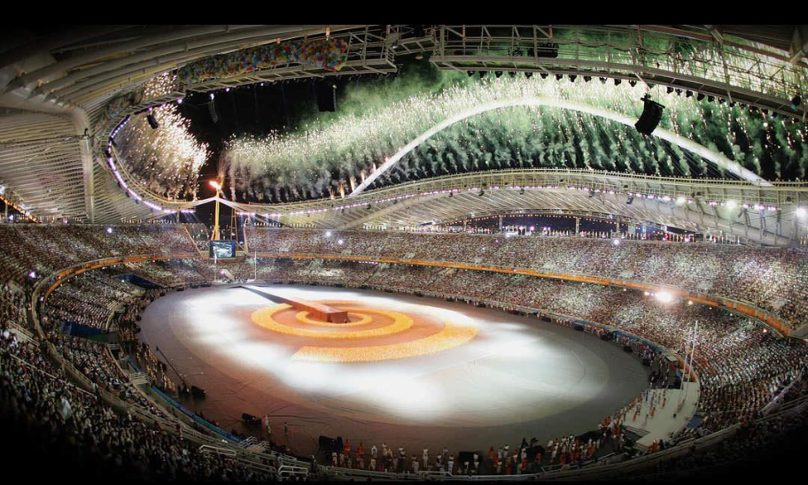
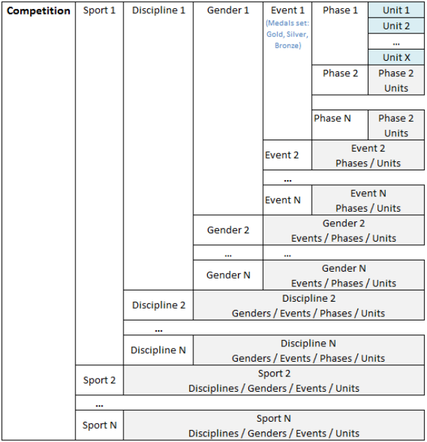

# ODF Foundation Principles: R-SOG-2024 FND V2.3 APP

Source: `C:\Users\mella\Downloads\ODF_Foundation_Principles_R-SOG-2024-FND.pdf`  
Source document date: 23 February 2024  
Source pages: 1-81  
Markdown extraction date: 2026-05-27

This Markdown file is a local extraction of the IOC ODF Foundation Principles PDF. The source table of contents below is parsed from the printed TOC on PDF pages 3-5, and the content preserves the document order from the source.

# Olympic Data Feed

**ODF Foundation Principles**

**Technology and Information Department**

**© International Olympic Committee**

**ODF R-SOG-2024 FND V2.3 APP**

**23 February 2024**



## Source Table of Contents

- [1 Introduction](#1-introduction) _(source p. 6)_
  - [1.1 About ODF](#1-1-about-odf) _(source p. 6)_
  - [1.2 Development of ODF](#1-2-development-of-odf) _(source p. 6)_
  - [1.3 Scope](#1-3-scope) _(source p. 7)_
  - [1.4 Objective](#1-4-objective) _(source p. 7)_
  - [1.5 Main Audience](#1-5-main-audience) _(source p. 7)_
  - [1.6 Project Governance](#1-6-project-governance) _(source p. 7)_
  - [1.7 Background](#1-7-background) _(source p. 8)_
  - [1.8 What ODF isn’t](#1-8-what-odf-isnt) _(source p. 8)_
  - [1.9 Change Management](#1-9-change-management) _(source p. 8)_
  - [1.10 Programme of the Olympic Games (excerpt from the Olympic Charter)](#1-10-programme-of-the-olympic-games-excerpt-from-the-olympic-charter) _(source p. 8)_
  - [1.11 Glossary](#1-11-glossary) _(source p. 9)_
  - [1.12 Documentation](#1-12-documentation) _(source p. 10)_
  - [1.13 Language and Translation](#1-13-language-and-translation) _(source p. 10)_
- [2 Understanding Sports Competitions](#2-understanding-sports-competitions) _(source p. 11)_
  - [2.1 Understanding Competitions](#2-1-understanding-competitions) _(source p. 11)_
  - [2.2 Messages and Data available](#2-2-messages-and-data-available) _(source p. 13)_
  - [2.3 Use of Sessions](#2-3-use-of-sessions) _(source p. 14)_
- [3 Message Definition](#3-message-definition) _(source p. 17)_
  - [3.1 Introduction](#3-1-introduction) _(source p. 17)_
  - [3.2 Encoding](#3-2-encoding) _(source p. 18)_
  - [3.3 ODF Message Structure](#3-3-odf-message-structure) _(source p. 18)_
  - [3.4 ODF Data Types and Formats](#3-4-odf-data-types-and-formats) _(source p. 24)_
- [4 Message Operation and Use](#4-message-operation-and-use) _(source p. 29)_
  - [4.1 Message generation systems](#4-1-message-generation-systems) _(source p. 29)_
  - [4.2 Competition Day, Start and Stop Transmission](#4-2-competition-day-start-and-stop-transmission) _(source p. 29)_
  - [4.3 Message Invalidation](#4-3-message-invalidation) _(source p. 30)_
  - [4.4 Message Frequency and Triggers](#4-4-message-frequency-and-triggers) _(source p. 30)_
- [5 Key Data Messages](#5-key-data-messages) _(source p. 31)_
  - [5.1 Participants](#5-1-participants) _(source p. 31)_
  - [5.2 Teams](#5-2-teams) _(source p. 32)_
  - [5.3 Horses](#5-3-horses) _(source p. 32)_
  - [5.4 Translated Names](#5-4-translated-names) _(source p. 33)_
  - [5.5 Schedule](#5-5-schedule) _(source p. 33)_
  - [5.6 Configuration](#5-6-configuration) _(source p. 34)_
  - [5.7 Results](#5-7-results) _(source p. 35)_
  - [5.8 Phase Results](#5-8-phase-results) _(source p. 35)_
  - [5.9 Cumulative Results](#5-9-cumulative-results) _(source p. 36)_
  - [5.10 Pools](#5-10-pools) _(source p. 36)_
  - [5.11 Brackets](#5-11-brackets) _(source p. 36)_
  - [5.12 Event Ranking](#5-12-event-ranking) _(source p. 36)_
  - [5.13 Medals](#5-13-medals) _(source p. 37)_
  - [5.14 Statistics](#5-14-statistics) _(source p. 37)_
  - [5.15 Play by Play](#5-15-play-by-play) _(source p. 37)_
  - [5.16 Current Data](#5-16-current-data) _(source p. 38)_
  - [5.17 Official Communications](#5-17-official-communications) _(source p. 38)_
- [6 Principles Used](#6-principles-used) _(source p. 39)_
  - [6.1 Codes](#6-1-codes) _(source p. 39)_
  - [6.2 RSC Level](#6-2-rsc-level) _(source p. 39)_
  - [6.3 ExtendedInfos](#6-3-extendedinfos) _(source p. 39)_
  - [6.4 Competitor unique identifiers](#6-4-competitor-unique-identifiers) _(source p. 40)_
  - [6.5 Participant Names](#6-5-participant-names) _(source p. 40)_
  - [6.6 Mandatory and Optional Elements/Attributes](#6-6-mandatory-and-optional-elements-attributes) _(source p. 41)_
  - [6.7 Empty values and updates](#6-7-empty-values-and-updates) _(source p. 41)_
  - [6.8 Ordering and Timing of messages](#6-8-ordering-and-timing-of-messages) _(source p. 42)_
  - [6.9 Sorting within Messages](#6-9-sorting-within-messages) _(source p. 42)_
  - [6.10 Which messages to process?](#6-10-which-messages-to-process) _(source p. 43)_
  - [6.11 Message Source in the Header](#6-11-message-source-in-the-header) _(source p. 43)_
  - [6.12 Use of an Explanatory Information Element](#6-12-use-of-an-explanatory-information-element) _(source p. 44)_
  - [6.13 Results Status](#6-13-results-status) _(source p. 45)_
  - [6.14 Extensions](#6-14-extensions) _(source p. 46)_
  - [6.15 Cumulative Messages, not all athletes progress](#6-15-cumulative-messages-not-all-athletes-progress) _(source p. 49)_
  - [6.16 Positive and Negative Tags](#6-16-positive-and-negative-tags) _(source p. 49)_
  - [6.17 Single athlete competing multiple times](#6-17-single-athlete-competing-multiple-times) _(source p. 49)_
  - [6.18 Teams of Teams](#6-18-teams-of-teams) _(source p. 50)_
  - [6.19 ODF Message Overwrite](#6-19-odf-message-overwrite) _(source p. 50)_
  - [6.20 Schedule Status Level](#6-20-schedule-status-level) _(source p. 51)_
  - [6.21 Guides, Pilots and Directors in the Paralympic Games](#6-21-guides-pilots-and-directors-in-the-paralympic-games) _(source p. 52)_
- [7 Data Collection and Initial Download](#7-data-collection-and-initial-download) _(source p. 53)_
  - [7.1 Data Collection](#7-1-data-collection) _(source p. 53)_
  - [7.2 Transfer Process](#7-2-transfer-process) _(source p. 55)_
  - [7.3 Functions for Officials Explained](#7-3-functions-for-officials-explained) _(source p. 57)_
- [8 Message Transmission](#8-message-transmission) _(source p. 60)_
  - [8.1 Options for Transmission](#8-1-options-for-transmission) _(source p. 60)_
  - [8.2 Online HTTP Message Transmission](#8-2-online-http-message-transmission) _(source p. 60)_
  - [8.3 Backup and Recovery](#8-3-backup-and-recovery) _(source p. 61)_
  - [8.4 Alternate Transmission Methods](#8-4-alternate-transmission-methods) _(source p. 63)_
- [9 Sequence of Messages](#9-sequence-of-messages) _(source p. 64)_
- [10 Appendices](#10-appendices) _(source p. 65)_
  - [10.1 Schedule and Results Status](#10-1-schedule-and-results-status) _(source p. 65)_
  - [10.2 Information for providers wanting to extend ODF](#10-2-information-for-providers-wanting-to-extend-odf) _(source p. 72)_
  - [10.3 RSC Codification Scheme](#10-3-rsc-codification-scheme) _(source p. 73)_
- [11 Document Control](#11-document-control) _(source p. 79)_
  - [11.1 File Reference](#11-1-file-reference) _(source p. 79)_
  - [11.2 Version History](#11-2-version-history) _(source p. 79)_
  - [11.3 Change Log](#11-3-change-log) _(source p. 79)_
## 1 Introduction

### 1.1 About ODF

The Olympic Data Feed (“ODF”) is a unique set of messages which can be delivered in
real time or point-in-time and containing point in time, live or archive sports related data,
including Schedules, Biographies, Start Lists, Results, Statistics, Records, Medallists,
Historical Results, Weather Data, etc. as further described in this document.

ODF is used for exchanging such data between Results and IT Providers, Organising
Committees, and without limitation other users including the International Sports
Federations, National Olympic Committees, media organisations (Broadcasters, News
Agencies, Newspapers, etc.) and Sports Website Providers.

The ODF specifications define a generic format to represent the results of sport
competitions. ODF uses a generic structure to provide a common data format for any
sport or competition whilst including the ability to include sport-specific extensions.

ODF is intended as a standard interface valid for all sports and all ODF users. ODF
standardises all data provided to users during sporting events by defining data structures
that are the ODF messages. The ODF describes the following:

      - messages that are not sport dependent (e.g. weather)

      - sport messages shared between all the sports (e.g. schedules)

       - sport messages that follow general rules for all sports, but that need to be extended to
incorporate sport-specific requirements (e.g. results)

The ODF data layer is designed to be independent of the transport mechanism as well
as the way the content could be rendered on various platforms (web sites, mobile
applications etc.).

### 1.2 Development of ODF

During the 1990s a standard was developed for providing Olympic results data to news
agencies. This was a text based solution distributed over serial lines known as the
WNPA Feed. From early 2000s a further series of interfaces was created at the Olympic
Games for exchanging data between central and local (venue) based results systems
using XML. While this new XML based system was provided to external users for their
own use, the multiplication of feeds was becoming difficult to produce, test and monitor.

In 2007 the IOC began working with its technology partners to develop an XML based
messaging system to replace the previous WNPA and internal XML systems with a
single XML interface solution which took into consideration the needs of all users.

This system was introduced at the 2010 Winter Games in Vancouver as it replaced the
WNPA Feed and was also tested internally in two sports as a replacement for the
internal messaging system. The London Games in 2012 saw the full introduction of ODF
for both internal and external messaging systems and was the sole solution for external
data users.

After the experience of 2012 the IOC began working on an enhanced version, ODF2,
due for introduction at the 2016 Games.

### 1.3 Scope

All ODF documentation follows the general messages and rules established in this
document, including summer and winter sports for the:

      - Olympic Games;

      - Youth Olympic Games;

      - Paralympic Games.

For other sports competitions the competition owner follows these Foundation Principles
as well as the General Messages documents though may provide its own sport specific
documentation and codes covering specific requirements.

### 1.4 Objective

The objective of the document is to describe the ODF technical standards which are built
according to the following design principles:

      - Sport independent: generic across sports with the aim to use the definitions between
sports whenever possible;

       - Consistent: data structures are consistent for a wide range of sports and systems;

      - Adaptable to future evolutions since the ODF design is based on XML extensions to
manage all situations;

       - Scalable in terms of:

`o` Number of messages

`o` Granularity (number of intermediates results or intermediate points…)

      - Data oriented: the ODF data structures are independent from any presentation layer
ODF users need to implement; and

      - Simple: easy to process and render as desired.

### 1.5 Main Audience

The main audience of this document is:

      - Information Technology suppliers of the systems generating and/or distributing ODF
messages (e.g. Timing & Scoring / Results Application Providers);

      - Sport data consumers, including Press Agencies, Broadcasters, Sports Federations,
National Olympic Committees, Major Sports Event Organisers and others; and

      - Technology Results Integrators

### 1.6 Project Governance

ODF is in constant development and managed by a small group of organisations
facilitated by the IOC to ensure it is always up-to-date and adapting to meet the needs of
its target audience.

The ODF documentation is maintained under the control of the IOC.

### 1.7 Background

Results management is a quite complex environment, as it involves a significant number
of sport disciplines, including numerous sport events, each with varied competition
formats and rules, and specific sport presentation requirements.

Many sport organisers are faced with a “visibility challenge” when news and results of
their events are not always picked-up by media organisations.

In certain cases, this is due to the profile of the event itself or the countless number of
events scheduled simultaneously among which media organisations need to select the
most relevant ones for their audience.

In some other cases, it is simply because these organisers do not have an easy way to
distribute to the media the information which could give their event better visibility.

In results management and distribution, there are also numerous IT companies that
provide their services to sport organisers. These companies range from very small (one
person providing services to local clubs) to very large (multinationals providing services
to major events worldwide including the Olympic Games). The level of sophistication of
the services provided varies from one end of the spectrum to the other.

The purpose of ODF is to provide to the whole sport results ecosystem (organisers, IT
providers, and media) a way to streamline the distribution of sport related information
among the different stakeholders. It is our hope and objective that a broad use of ODF
will make results distribution as easy as plug-and-play.

### 1.8 What ODF isn’t

ODF is not intended to display or print results nor is it to manage all aspects of a
competition, it is a data feed of the competition information only. Nor is ODF a repository
of results data from past competitions.

### 1.9 Change Management

For the Olympic Games and the Paralympics, the IOC manages the constant ODF
evolution under strict change control.

The IOC encourages all ODF users to report issues and provide feedback on potential
areas for improvement. All suggestions will be analysed with due care and implemented
globally as appropriate. When certain suggestions cannot be implemented because of
their too-specific nature, it will always be possible to implement them for individual use
using XML extensions.

All feedback should be provided using the ODF contact details available on the
documentation site.

### 1.10 Programme of the Olympic Games (excerpt from the Olympic Charter)

The Programme of the Olympic Games is the programme of all competitions of the
Olympic Games established for each edition of the Olympic Games by the IOC.

The components of the programme are sports, disciplines and events.

The sports are those sports governed by the IFs.

A discipline is a branch of a sport comprising one or several events.

An event is a competition in a sport or in one of its disciplines, resulting in a ranking and
giving rise to the award of medals and diplomas.

### 1.11 Glossary

The following abbreviations are used in this document

|Acronym|Description|
|---|---|
|CC @CodeEntity|This is a reference to a code set, where CodeEntity is the name of<br>the entity that identifies a set of codes, for example CC @Discipline<br>is the discipline code set.|
|Competition|An overall sporting meeting including one or more sports. For<br>example, the 2016 Olympic Games.|
|Gender|Gender has two meanings, gender of a person (man/women) or<br>gender of an event (for men, women, mixed, any)|
|IF|International Federation, the international governing body of a sport|
|IOC|International Olympic Committee|
|IPC|International Paralympic Committee|
|IRM|Invalid Results Mark, which is a generic term used to describe results<br>such as, without limitation:<br>DNS: Did Not Start<br>DNF: Did Not Finish<br>DSQ: Disqualified (depending on sport)<br> <br>The list of IRMs is sport discipline specific.|
|NOC|National Olympic Committee recognized as such by the IOC|
|NPC|National Paralympic Committee as recognized by the IPC|
|ODF|Olympic Data Feed|
|ODS|Olympic Diffusion System, central technology system which<br>manages many disciplines.|
|OIS|Olympic Information Service|
|ORIS|Olympic Results and Information Services|
|OVR|On-Venue Results system|
|Phase|A group of units at the same level in an event, for example heats in<br>Swimming, pool matches in Basketball or quarterfinals in tennis.|
|RSC|Results System Codes, identify uniquely one unit of any competition,<br>specifying the discipline, gender, event, phase and unit.|
|SC @CodeEntity|This is a reference to a sport code set, where CodeEntity is the name<br>of the entity that identifies a set of sport codes, for example SC<br>@Period is the period code set.|
|Unit|An individual part of an event, for example a single heat in<br>Swimming, a match in Tennis or a bout in Boxing.|
|WNPA|World News Press Agencies|

### 1.12 Documentation

The following documentation is available for ODF. The documents are listed in order in
which they should be read:

|Document Title|Document Description|
|---|---|
|ODF Foundation Principles|This document lays the foundation for creating and<br>using ODF.|
|ODF General Messages Interface<br>Document|This document describes the ODF messages|
|ODF Data Dictionaries (One per<br>discipline)|This document details and extends the ODF<br>messages described in ODF/INT184 for each sport|
|ODF Language Guidelines and<br>Participant Names|This document details the policies related to<br>participant names.|
|ODF Codes Document|This document describes the ODF codes used across<br>the ODF documents|
|ODF Schema|The ODF schema is the tool that helps with the<br>syntactical message validation when developing or<br>testing ODF messages.|
|ODF samples|The ODF samples are a collection of sport messages**. **|

Some of these documents may vary from competition to competition.

### 1.13 Language and Translation

The majority of information related to sports competitions and results is language
independent, that is, it deals with participants and numbers (participant names in
different languages are managed in a different way, see ODF Language Guidelines and
Participant Names.

The default language for all ODF messages is English.

When multiple languages are used:

      - The ‘Language Code’ in the header indicates the language in which the ODF
message is written;

      - Textual information within the body of the message is written in the language
indicated by the language code.

When only English is used:

      - The ‘Language’ Code may not be included in the header. Where there is no language
code then English is assumed.

For the results messages most sports terms (like event names, functions) are fixed so
automatic translation is possible and provided in the codes for supported languages as
applicable.

Some terms may appear to be non-English but these are usually sport specific as in
Judo or Taekwondo.

## 2 Understanding Sports Competitions

### 2.1 Understanding Competitions

To manage data distribution for sports competitions each competition is broken down
into its component parts so that is easier to manage and understand.

Usually the component parts of an event are a series of competition units which each
have a “winner”, and by various means, progress to find an overall winner. In some
cases, there may be only one “unit” like in a marathon.

Although sports are very different from one another, ODF users who deal with multiple
and diverse sports will gain in efficiency by using common terms and data structures.

The following explains how sport competition results are broken down for the purposes of
ODF and the distribution of data.

#### 2.1.1 Basic Competition Hierarchy

From the data point of view a sport competition is a set of data container units. These
**units** are intended to store the information of each sport activity (in general an activity
done by a group of athletes in a field of play during a certain period of time leading to a
classification / winners).

An **event** is a group of units that lead to a medal set (gold, silver and bronze). Usually
the units are sub-grouped into **phases** that determine the progress within the event.

Each **gender** (male, female, mixed or open) has a set of events. A **discipline** is
composed by a set of events of each of its genders; a **sport** is a set of disciplines. See
the representation below.



The basic competition hierarchy is seen here with a series of examples (there are of
course many others with different formats, this only shows some common examples):

|Level|Team Sports|Timed and Judged Sports|Head to Head|
|---|---|---|---|
|Sport|Football / Ice Hockey|Aquatics / Skiing|Tennis|
|Discipline|Football / Ice Hockey|Swimming / Alpine Skiing|Tennis|
|Gender|Men|Women|Women|
|Event|Men’s Tournament|200m Freestyle|Women’s Singles|
|Phase|Quarterfinals|Heats|Semifinals|
|Unit|Quarterfinal 1|Heat 5|Semifinal 2|

Notes:

       - There are sports that have only one discipline (e.g. Handball)

       - There are disciplines that have only one gender (e.g. Artistic Swimming)

      - There are events that have only one unit (e.g. Men’s Marathon)

      - Normally there is a one to one correspondence between the physical sport activity
units and its corresponding data containers, but there are some special cases where
a physical sport activity produces data for more than one data container (e.g. in
artistic gymnastic an athlete participation may produce score for the apparatus and for
the all-around).

### 2.2 Messages and Data available

The ODF messages are data messages and may include encapsulated images, PDFs
etc.

To meet the needs of managing a competition and distributing the associated
competition information, the following messages are defined in ODF:

      - Control Messages (not managing data, only controlling the feed)

      - News and informational messages

      - Biographies

`o` Athletes

`o` Coaches

`o` …

     - Records

     - Weather

       - Participant Lists

      - Schedules

      - Results

`o` Units

`o` Phases

`o` PDF

      - Extended Results

`o` Results Analysis

`o` Current Information

`o` Images

`o` Records

`o` Statistics

`o` Play-by-Play

      - Medal information

`o` By Event

`o` By Sport

`o` …

This list is not exhaustive but simply illustrates the possible information types that may be
available at certain sports competitions. Each sports competition organiser must
determine what is appropriate, with ‘unit results’ being the most fundamental. The related
documents (see section 1.12) provide the details for the Olympic Games and may be
adapted for other competitions.

### 2.3 Use of Sessions

A session is a grouping of one or more event units which take place without significant
breaks, in one or more locations within a venue within a single day.

Different parties use sessions to meet their needs.

#### 2.3.1 Sport or “Competition” Sessions.

This is the logical grouping of the event units which are grouped for the use of sport.

This grouping is usually considering all locations in a venue for all events unit where
there is a no significant gap between sessions (there can be gaps, even up to 2 hours or
more). This competition session is usually related to open/close gates and will often be
the same as ticketing.

#### 2.3.2 Ticketing Sessions

This is the grouping used to sell tickets to a competition and usually follows competition
sessions except where locations (like tennis courts) are also sold separately.

The common “special cases” are:

      - Tennis: It may be that a competition session has three ticketing sessions, centre
court, court 1 and outside courts.

       - Shooting: If there are multiple finals locations like pistol and trap then one competition
session may have multiple ticketing sessions.

      - Modern Pentathlon: There may be a ticketing “session” which is a group of
competition sessions, one ticket for all competition sessions in the event.

      - Nordic Combined: This discipline uses one ticketing session code for two sessions,
with different competition session codes, taking place in two nearby venues as
athletes move from ski jumping to cross country.

      - Alpine Combined: Depending on the venue, the athletes might need to move
depending on facilities which can mean multiple sessions but a single ticketing
session.

#### 2.3.3 Broadcast Sessions

This is the grouping of units related to a broadcast transmission session. This may follow
competition session but can be different if there are multiple transmissions in a discipline
(athletics) or there is a short break in the competition (alpine slalom).

#### 2.3.4 ODF and Sessions

Sessions are not used for all units for the Games, some are excluded due to the way the
way in which the units are used and or managed.

For example, some activities do not have sessions, this applies to for example, activities
scheduled in the Olympic Village (like flag raising ceremonies) or media conferences or
unofficial training. These activities are not controlled or pre-planned in the same way as
competition units.

Sessions are required to be used (and distributed via ODF for all units) which take place
on the field of play and are managed in OVR which therefore includes all official training
and competition. This excludes team captain’s meetings and draws etc.

ODF includes three concepts of session data:

       - The session itself with a start and end time [see DT_SCHEDULE Competition /
Session]
```
        <Session Code="ATH01" StartDate="2016-08-12T10:00:00+01:00"
        EndDate="2016-08-12T14:00:00+05:00" LeadIn="5:00" Venue="STA"
        VenueName="Olympic Stadium" SessionType="AFT">
```

      - Session Type as morning, afternoon etc [see DT_SCHEDULE Competition / Session
@SessionType]

       - Linking competition units to sessions [see DT_SCHEDULE Competition / Units
@SessionCode] to link units to a defined session.
```
        <Unit Code="BDMMSINGLES-----------FNL-0001----" PhaseType="3"
        ScheduleStatus="SCHEDULED" StartDate="2016-08-05T14:00:00+05:00"
        EndDate="2016-08-05T14:00:00+05:00" Medal="1" Venue="ABC"
        Location="BD1" SessionCode="BDM12" >

```

**2.3.4.1** **Competition Session Code**

The session code is usually defined as DDDnn, where DDD is a 3-letter code usually
representing discipline and nn a unique number within the discipline. There may be
variations to the principle in some circumstances including using a longer code.

The competition session code for use in the Olympic Games is in the format:

DDDnn where

DDD = Discipline Code
nn = Sequential numbering

Code is predetermined by the IOC and the OCOG and its partners and distributed as
part of the competition schedule. The code must be unique within the entire Competition
schedule and not change in the lead-up to the Games.

Due to the impact of changes in the session codes (particularly for ticketing) the session
codes are frozen before there are any ticketing requests, usually around 18 months prior
to the Games. After that time sessions can be added or events in a session can be
changed but the session code is not changed.

Sessions are usually numbered sequentially from the start of the sports activities to
follow a logical sequence and simple to use and understand. In the cases where there is
a single field of play in a venue within in a discipline (like football) then ticketing sessions
will usually follow competition sessions.

For official training (usually where there is start list) like in sliding sports, ski jumping,
downhill etc then a special codification applies for these sessions. These sessions are
coded in the following way (and are not usually available 18 months before the Games).

DDDTa where

DDD = Discipline Code
T = T for training
a = alphabetic character

**2.3.4.2** **Special Cases for Sessions**

There are some cases which need to be analysed and rules applied so all users
understand the expectations and processes.

If after competition starts, there are changes to the competition schedule and units can
be postponed or cancelled.

**2.3.4.2.1** **Some units are moved to a different pre-existing session due to weather conditions**

This is common in tennis and sailing.

- The session does not change, it remains on the scheduled day.

       - Some units are moved to a different pre-existing session.

There are no additions or changes in the session codes.

**2.3.4.2.2** **All units in a session are moved to a different pre-existing session due to weather**
**conditions**

Can happen in rowing or other sport if the wind conditions are unsuitable.

      - The “cancelled” session does not change, it remains on the scheduled day. The
status is updated in ODF to CANCELLED.

       - All units are moved to a different session or sessions.

**2.3.4.2.3** **A full session (and all units) is moved to a different day**

This is frequent in single unit sessions affected by the weather like alpine skiing.

        - The full session and all units are moved to the new day

This will mean after the move the session codes may no longer be sequential. In this
circumstance the session code (and other session codes) MUST NOT CHANGE to
become sequential.

**2.3.4.2.4** **Some units are moved to a new (non-existing) session**

This could happen if for example weather conditions deteriorate during a session.

This will require a new session to be created and usually the next sequential session
code will be used. Note the session codes may no longer be sequential throughout the
competition (unless this new session was after all others).

**2.3.4.2.5** **Unit (or Units) started but are not completed in a session**

This could happen if for example, weather conditions deteriorate during a session. In
tennis or golf the match/round starts but is unable to finish. In this case the unit is
completed in a subsequent session (pre-existing or not) but the session associated to the
unit does not change.

**2.3.4.3** **Victory/Medal Ceremonies**

In Winter Games most of the Victory Ceremonies take place in the medal plaza.

This is managed with special sessions for this venue but include units from various
disciplines.

SessionCode=”MDL06”

LocationName=”Medals Plaza”

This may include several victory ceremonies such as:

```
      ALPWSL----------------VICTMEDAL--      BOBMTEAM2-------------VICTMEDAL--      BTHM10KMSP------------VICTMEDAL--
```

For Victory and flower ceremonies that take place in the venue, they should be listed as
part of the competition session at the appropriate time.

## 3 Message Definition

### 3.1 Introduction

The objective of this section is to present the general XML structure of the ODF
Messages based on which each ODF Sport Data Dictionary is further developed.

Some important considerations for the ODF messages:

      - ODF messages are generally full messages and as such replace the previous version
of the same message (same unit etc.).

`o` There are some other messages which only update part of the information from

previous messages, for example _UPDATE (Schedule and Participants) and the
DT_RECORD message depending on the header values.

`o` The DT_CURRENT message is different again and is a stand-alone message

which provides information on the current situation in a unit or event.

      - Mandatory attributes must always be sent. If they do not have any value then they
must be sent empty (Attribute ="")

       - Known optional attributes must always be sent (e.g. Place of Birth) unless in special
circumstances.

      - Empty optional attributes must be sent either empty (Attribute = "") or not sent.
However, to reduce implementation variations and message size it is expected that
empty optional elements are not sent. It is expected that ODF clients will be able to
process messages either way without any restriction.

      - In addition to not sending optional empty values (="") the messages also should not
contain zeros unless they zeros have meaning. For example, at the start of a match in
a team sport the scores are sent as ="0" as is the first period score. However, the
statistics for all players are not sent unless there is valid statistic data captured as
zero has meaning and this just increases the size of messages without adding
information. Some data should be sent as zero when it has meaning (like if a player
misses a shot after taking a shot (1 shot, 0 made). The same rule applies for
percentages. The same principle applies in other messages like pool standings, do
not send all zeros if a team has not played. These are general principles and may be
overridden by specific rules in specific sports.

      - ODF messages contain elements further refined by one or more attributes used to
provide additional information about the element. A one-attribute element could for
instance be Code for a Competitor element; a multiple-attribute element could for
instance add the name of the competitor.

      - Elements must be listed in the order stated in the corresponding ODF message
definition. The XML structure should be defined according to a schema (XSD) to
ensure full conformance to XML (not more, not less). Any order or other constraints is
represented in the schema to ensure a maximum of automatic validation. A schema
reference containing all those constraints is provided concurrently with the dictionary.

       - The order of attributes is not important.

      - ODF is designed in such way that elements and attributes are organized to minimize
redundancy and dependency. However, to reduce re-processing data and simplify its
rendering, information may be repeated in different messages.

### 3.2 Encoding

The character set to be used in all information exchange is the standard Unicode UTF-8
which is declared in each message.

```
       <?xml version= "1.0" encoding= "utf-8" ?>

### 3.3 ODF Message Structure

```

The ODF General Messages Interface Document defines the structure of the ODF
messages in details.

ODF messages are data structures based on standard XML:

```
       <?xml version= "1.0" encoding= "UTF-8" ?> ODF Declaration
       <OdfBody DocumentType=… DocumentCode=… > ODF Header
         <Competition … )Message Body
         [body] )
       </OdfBody>

```

#### 3.3.1 ODF Declaration

The start of an ODF message is the XML declaration. It defines the XML version and the
encoding used, UTF-8.

#### 3.3.2 ODF Header

The ODF header is the root element of the message and it always has the element name
OdfBody.

Header attributes identify ODF messages uniquely and provide standard information
about each message. The header can be used to easily apply filtering of messages.

The message unique identifier is the aggregation of the following attributes:

      - CompetitionCode

     - DocumentCode

     - DocumentSubcode

     - DocumentType

     - DocumentSubtype

     - Language

     - Source

      - Version

The following table describes the ODF header attributes. “M” indicates mandatory
attributes that must appear in all ODF messages. “O” indicates optional attributes.
Optional attributes may be required depending on other attributes in the header.

|Attribute|M/O|Value|Comment|
|---|---|---|---|
|CompetitionCode|M|CC @Competition<br>[max. char(15)]|Unique ID for competition|
|DocumentCode|M|S(34)|DocumentCode can have different<br>values depending on the nature of<br>the message.<br> <br>RSC is used for Results messages<br>and is structured to include the<br>discipline, discipline gender, event<br>phase and unit.<br> <br>The other possible values include<br>(depending on the message) the ID<br>of an athlete (for biographies),<br>sequential numbers (for<br>background imports) etc. Full<br>details are documented in the ODF<br>General Data Dictionary.|
|DocumentSubcode|O|S(34)|Extension for the DocumentCode<br>Used when the RSC is not<br>sufficient to uniquely identify the<br>content of the XML message.|
|DocumentType|M|S(30)|Message Type (e.g. DT_RESULT)|
|DocumentSubtype|O|S(20)|Attribute used to extend<br>DocumentType for some<br>messages.|
|Version|M|1..V|Version of the message, sequential<br>number with the highest indicating<br>the most recent version.<br>Increments when the unique<br>identifier fields without version are<br>the same.<br>(Positive integer)|
|ResultStatus|O|CC @ResultStatus|Defines the status of the result<br>included in the message.|
|Language|O|CC @Language|Language used for message<br>content.<br> <br>If the message is distributed in<br>multiple languages then this<br>attribute should always be<br>included.<br> <br>Where a message is not defined in<br>multiple languages, this attribute<br>must not be included. In this case<br>of a single language then the<br>language of the message is<br>English.|
|FeedFlag|M|“P”-Production<br>“T”-Test|Test message or production<br>message.|

|Attribute|M/O|Value|Comment|
|---|---|---|---|
|Date|M|Date|Date when the message is<br>generated, expressed in the local<br>time zone where the message was<br>produced.|
|Time|M|Time|Time up to milliseconds when the<br>message is generated, expressed<br>in the local time zone where the<br>message was produced.|
|LogicalDate|M|Date|Logical Date of events. This is the<br>same as the physical day except<br>when the unit or message<br>transmission extends after<br>midnight.<br> <br>If an event unit continues after<br>midnight (24:00), all messages<br>produced will be considered as<br>happening at the logical date on<br>which the event unit began (e.g. for<br>a session which began at 21:00 on<br>Aug 2 and ended at 1:20 on Aug 3,<br>the message will all be dated Aug<br>2).<br> <br>The end of the logical day is<br>defined by default at 03:00 a.m.<br> <br>For messages corrections, like<br>invalidating medals or Records, it<br>will be the LogicalDate of the day<br>of the correction.<br> <br>Logical Date is expressed in the<br>local time zone where the message<br>was produced.|
|Source|M|SC @Source|Code indicating the system which<br>generated the message.|

**Sample**

```
       <?xml version= ”1.0” encoding= ”utf-8” ?>
       <OdfBody CompetitionCode= ”OG2020” DocumentCode= ”ATHM100M--------------FNL-0001---       " DocumentType= ”DT_RESULT” Version= ”3” ResultStatus= ”OFFICIAL” FeedFlag= ”P”
       Date= ”2012-08-03” Time= ”162843056” LogicalDate= ”2012-08-03” Source= ”ATHOLY1” >
       ……

```

#### 3.3.3 Message Body

The message body of ODF messages follows the ODF Header.

|<?xml version=”1.0|” encoding=”UTF-8”?>|Declaration|
|---|---|---|
|`<OdfBody DocumentType=…>` <br> <br>`<Competition>` <br>**`Message Body`**|`<OdfBody DocumentType=…>` <br> <br>`<Competition>` <br>**`Message Body`**|**`ODF Header`**|
|<br> <br>**`… `**<br> <br>`</Competition>`|||
|`<Note>`**` Athlete nnn`**|**` n disqualified…`**`</Note>`||

```
       </OdfBody>

```

**3.3.3.1** **<Competition> Element**

All valid ODF messages contain the element <Competition>.

```
       <Competition>

```

**3.3.3.2** **<Note> Element**

Any ODF message can contain an optional element <Note> to include non-formatted
free text (to provide additional non-structured information if needed). This is typically
used for explaining modifications to results (disqualified etc.)

<Note> element follows the <Competition> element. XML invalid characters <, &, >,”
and ‘ are escaped. < as “&lt;” & as “&amp;” > as “&gt;” “ as “&quot;” and ‘ as &apos;. Any
other character will not be escaped.

Example:
```
       <Note> PEÑA Jorge (ESP) &quot; reinstated &quot; after protest. </Note>

```

See 6.12 for more details regarding the use of this element.

**3.3.3.3** **<Competitor> Element**

Certain ODF messages contain an optional element <Competitor> to include information
about Athletes, Teams or Groups. Group is used when competitors of same or different
organisations participate in an event together but are not considered a team and their
results are individuals.

|Element|Attribute|M/O|Value|Comment|
|---|---|---|---|---|
|Competitor|Code|M|S(20) with no<br>leading zeroes|Competitor ID|
|Competitor|Type|M|T, A, G|T = Team<br>A = Athlete<br>G = Group|
|Competitor|Organisation|M|CC @Organisation|Competitor’s<br>organisation.<br>(MIXn is used in the case<br>of Type G.)|

**If Competitor is an Athlete:**

      - <Competitor> element contains:

`o` The mandatory attribute Type = ”A”;

`o` The mandatory attribute Code which contains the AthleteID. This attribute links to

an athlete listed in the DT_PARTIC message;

`o` The attribute Organisation provides the organisation of the athlete;

`o` The mandatory element <Composition>.

      - <Composition> element contains the mandatory element <Athlete>

      - <Athlete> element contains:

`o` The mandatory attribute Code which contains the AthleteID (which is the same as

in the <Competitor> element);

`o` The mandatory attribute Order =”1”;

`o` The optional attribute Bib;

`o` Sport specific extensions as defined in the ODF Discipline Data Dictionary;

`o` In some messages the <Athlete> element contains the mandatory element

<Description> which contains description information about the athlete.

      - <Description> element contains:

`o` The optional attribute GivenName which contains the athlete’s given name in

mixed case;

`o` The mandatory attribute FamilyName which contains the athlete’s family name in

mixed case;

`o` The mandatory attribute Gender;

`o` The mandatory attribute Organisation which contains the athlete’s organisation

which will be the same as Organisation in the Competitor element;

`o` The optional attribute Birthdate which contains the athletes birth date in the format

YYYY-MM-DD;

`o` The optional attribute IFId which contains the international federation id of the

athlete and should be the same as listed in DT_PARTIC;

`o` The optional attribute Class which contains the sport class for athletes in the

Paralympic Games.

`o` The optional attributes Guide, GuideFamilyName and GuideGivenNam which

contain the guide information for athletes in the Paralympic Games.

```
       <Competitor Code= “878987” Type= ”A” Organisation= ”SUI” >
         <Composition>
           <Athlete Code= ”878987” Order= ”1” Bib= ”10” >
            <Description GivenName= ”John” FamilyName= ”Smith” Gender= ”M”
       Organisation= ”SUI” BirthDate= ”1976-12-15” IFId= ”123423” />
           </Athlete>
         </Composition>
       </Competitor>

```

**If Competitor is a Team:**

      - <Competitor> element contains;

`o` The mandatory attribute Type =”T”;

`o` The mandatory attribute Code = TeamCode. This attribute links to a team listed in

the DT_PARTIC_TEAMS message;

`o` The optional attribute Bib which is the Bib of the team;

`o` The attribute Organisation provides the organisation of the team;

`o` The optional element <Composition>. This element is optional because there are

situations where the team members are not known when the message is
generated.

`o` Team sport specific extensions as defined in the ODF Discipline Data Dictionary;

`o` The optional element <Description> which is mandatory in the case of a team

(optional as it is not sent when the competitor is an individual).

- <Description> element contains:

`o` The optional attribute TeamName which contains the name of the team;

`o` The optional attribute IFId which contains the international federation id of the

team.

      - <Composition> element contains the mandatory element <Athlete>.

      - <Athlete> element contains:

`o` The list of athletes that are the team members for the applicable event unit;

`o` The mandatory attribute Code which contains the AthleteID. This attribute links to

an athlete listed in the DT_PARTIC message;

`o` The mandatory attribute Order with the team members sort order starting at 1;

`o` The optional attribute Bib;

`o` Team members’ sport specific extensions as defined in the ODF Discipline Data

Dictionary.

`o` The mandatory element <Description> as described above (when the Competitor

is an athlete).

```
       <Competitor Code= ”T2145” Type= ”T” Organisation= ”SUI” >
         <Description TeamName= ”Switzerland” />
         <Composition>
           <Athlete Code= ”4357627” Order= ”1” >
            <Description GivenName= ”Jane” FamilyName= ”Smith” Gender= ”W”
       Organisation= ”SUI” BirthDate= ”1976-12-15” IFId= ”123456” />
           </Athlete>
           <Athlete Code= ”4333627” Order= ”2” >
            <Description GivenName= ”Jenny” FamilyName= ”Jones” Gender= ”W”
       Organisation= ”SUI” BirthDate= ”1976-09-15” IFId= ”123234” />
           </Athlete>
           …
         </Composition>
       </Competitor>

```

Note: Although team members for the event are listed in the DT_PARTIC_TEAMS
message, specific ODF Sport messages will also include the team members for each
event unit.

**If the Competitor is a Group** the message is the same as for a Team, except for:

      - <Competitor> element contains

`o` the mandatory attribute Type = ”G”

`o` the mandatory attribute Code = NOC/NPC when the athletes belong to the same

organisation, otherwise MIXn to indicate the participants are from different
organisations. (Defined as MIX followed by numeric)

Here is an example of the use of ”G” in Modern Pentathlon. Note the members of the
group receive individual results.

```
       ……
       <Result SortOrder= ”4” StartOrder= ”4” StartSortOrder= ”4” >
         <Competitor Code= ”MIX4” Type= ”G” Organisation= ”MIX” >
           <Composition>
            <Athlete Code= ”1065564” Order= ”1” Bib= ”227” >
              <Description GivenName= ”Jane” FamilyName= ”Smith” Gender= ”W”
       Organisation= ”SUI” BirthDate= ”1997-07-15” IFId= ”12345443” />
            </Athlete>
            <Athlete Code= ”1087051” Order= ”2” Bib= ”219” >
              <Description GivenName= ”Jenny” FamilyName= ”Jones” Gender= ”W”
       Organisation= ”ESP” BirthDate= ”1998-06-15” IFId= ”324522” />
            </Athlete>
           </Composition>
         </Competitor>
       </Result>
       ……

```

### 3.4 ODF Data Types and Formats

This chapter describes data types and formats used in ODF messages.

#### 3.4.1 Format Strings

The following table describes the custom numeric format specifiers and displays sample
output produced by each format specifier. These specifiers and designators are used in
defining specific formats. See the example section for an illustration of their use.

|Format specifier<br>or designator|Name|Description|Example|
|---|---|---|---|
|Y|Year|Represents a digit used in the time<br>element “year”. Usually used as fixed<br>number of characters, YYYY or YY|For the year 2016:<br>in YYYY = 2016<br>in YY = 16|
|M|Month|Represents a digit used in the time<br>element “month”. In ODF it is always<br>used as MM.|For the month July:<br>in MM = 07<br>For the month December:<br>in MM = 12|
|D|Day|Represents a digit used in the time<br>element “day”|For the 5th of the month:<br>in DD = 05<br>in D = 5<br>For the 15th of the  month:<br>in DD = 15<br>in D = 15|
|h|hour|Represents a digit used in the time<br>element “hour”|For 5am or 5 hours:<br>in hh = 05<br>in h = 5<br>For 3pm or 15 hours:<br>in hh = 15<br>in h = 15|
|m|minute|Represents a digit used in the time<br>element “minute”.|For 5 minutes<br>in mm = 05<br>For 5 minutes<br>in m = 5<br>For 15 minutes<br>in mm = 15|
|s|second|Represents a digit used in the time<br>element “second”. In ODF it is always<br>used as ss.|For 5 seconds<br>in ss = 05<br>For 15 seconds<br>in ss = 15|
|f|fraction of second|Represents a digit used in the time<br>element “fractions of a second”<br>The final display of time can vary by<br>sport rules and any variations are<br>described in the sport specific data<br>dictionaries.|For 0.5 seconds<br>in ff = 50<br>in f = 5<br>For 0.18 seconds<br>in ff = 18|
|0|Positive integer|Data numeral. Replaces the zero with<br>the corresponding digit if one is<br>present; otherwise, zero appears in<br>the result string|For 1546<br>in 0000 = 1546<br>in 00000 = 01546<br>For 1234.5678<br>in 00000 = 01235<br>For 0.45678<br>in 0.00 = 0.46<br>(See rounding rules below)|

|Format specifier<br>or designator|Name|Description|Example|
|---|---|---|---|
|#|Digit placeholder|Data numeral. Replaces the “#”<br>symbol with the corresponding digit if<br>one is present; otherwise, no digit<br>appears in the result string except<br>where it is in the digit to the left of a<br>decimal which must be shown as zero<br>if applicable.|For 1546<br>in ###0 = 1546<br>For 1234.5678<br>in ####0 = 1235<br>For 0.45678<br>in 0.## or #.## = 0.46<br>(see rounding rules below)|
|.|Decimal point|Determines the location of the<br>decimal separator in the result string.||
|Z||Is used as UTC designator.||
|-|Hyphen|to separate the time elements “year”,<br>“month” and “day”.|2016-12-15|
|:|Colon|to separate the time elements “hour”,<br>“minute” and “second”|12:15|

#### 3.4.2 Formats used in ODF

The following is the list of most common formats used in ODF.

|Format|Format Description|
|---|---|
|CC @CodeEntity|This is a reference to a code set, where CodeEntity is the name of the entity that<br>identifies a particular set of codes, for example CC @Discipline is the discipline code<br>set.|
|String|Text strings without a predetermined length used in attributes without html|
|S(n)|Text strings with a length of up to n characters|
|Date|YYYY-MM-DD|
|Time|hhmmssfff<br>• <br>hh: hour<br>• <br>mm: minutes<br>• <br>ss: seconds<br>• <br>fff: milliseconds<br>All formatted with leading and trailing zeros (example: 090303020, 150712530).|
|DateTime|YYYY-MM-DDThh:mm:ssTZD (e.g.: 2006-02-06T13:00:00+01:00)<br>• <br>YYYY: year<br>• <br>MM: Month<br>• <br>DD: day<br>• <br>hh: hour<br>• <br>mm: minutes<br>• <br>ss: seconds<br>TZD is the Time Zone Designator (Z or +hh:mm or –hh:mm) where the message was<br>produced and when the message was produced. “Z” is the zone designator for the zero<br>UTC offset|
|Other Time Formats|Other time formats are also described in the Data Dictionaries.<br>For example h:mm:ss for hour, minutes and seconds. Where such formats are used,<br>unless specifically defined any leading zeros are removed.<br>If the format is h:mm:ss and the data is 5 minutes and 20 seconds it is written 5:20.|
|Boolean|‘true’ or ‘false’|

|Format|Format Description|
|---|---|
|Numeric|Number with no predetermined length where the full value must be sent and displayed<br>without leading zeros.<br> <br>Where a specific format is known then it is described as below (next row) in specific<br>patterns.|
|Specific Numeric<br>Pattern|Attributes with a specific pattern not specified in this table. Some examples include:<br>0000 = Number with length up to 4 digits, all digits displayed including leading zeros<br>###0 = Number with length up to 4 digits, do not display leading zeros.<br>#0.00 = Number with length up to 2 digits and 2 decimals, do not display leading zeros.<br>#0.## = Number with length up to 2 digits and 2 decimals, do not display leading zeros<br>or trailing zeros after decimal.<br>0 = Number with a single digit<br>s.ff = time in seconds and hundredths of seconds<br>h:mm:ss = Time in hours, minutes and seconds.<br>Hh:mm:ss = Time in hours, minutes and seconds with leading zero for hours.|
|Free text|Free text is never used in a message attribute, but it can be used inside the element<br>content. Free text is usually longer and explanatory compared to a string.<br>Example <element>Free text goes here</element>.<br>XML invalid characters <, &, >,” and ‘ are escaped. < as “&lt;” & as “&amp;” > as “&gt;”<br>“ as “&quot;” and ‘ as &apos;. Any other character will not be escaped.|

More formats may be defined in the Sport Data Dictionaries using the specifiers defined
in section 3.4.1.

#### 3.4.3 Common Number and Time formats

This section describes measurement formats and the conversion rules to use in all
messages, unless other formats or rules are specified in the sport documentation.

|Measure|Format|Example|
|---|---|---|
|Height/Distance|#0.00m<br>##0cm<br>#’#0’’|1.83m<br>183cm<br>6’0’’|
|Weight|##0kg<br>##0lbs|100kg<br>220lbs|
|Temperature|#0ºC<br>##0ºF|35ºC<br>95ºF|
|Distance|#0.000km<br>#0.000mi|1.789km<br>6.123mi|
|Speed|#0.000m/s<br>#0.000mph<br>#0.000km/h|1.789m/s<br>6.123mph<br>3.890km/h|
|Precipitation|#0mm<br>#0in|2mm<br>1in|

#### 3.4.4 Rules for measurement conversion

These are the conversion rules to use in all messages, unless other rules are specified in
the sport documentation. When using these conversions for athlete heights and weights
the rounding rules must also be applied.

|Measure|Conversion Rules|
|---|---|
|**Distance**|1in = 0.0254m<br>1ft = 12in = 0.3048m<br>1yd = 3ft = 36in = 0.9144m<br>1mi = 1,760yd = 5,280ft = 63360in = 1609.344m<br>1nmi (nautical mile) = 1,852m<br>1m<br>= 39.37007874in<br> <br>= 3 ft 3.37007874in<br> <br>= 1 yd 3.37007874in<br>1 km = 0.62137119224mi<br> <br>= 0.8689762419nmi|
|**Speed**|1m/sec = 3.6km/hr<br>1km/h = 0.27777777778m/sec<br>1kt = 1nmi/h|
|**Weight**|1lbs = 0.453 592 37kg<br>1kg = 2.2046226218lbs|
|**Temperature**|T[°F] = 1.8 × T[°C] + 32<br>T[°C] = (T[°F] – 32) / 1.8|

#### 3.4.5 Rules for rounding numbers

This chapter describes the rules for rounding numbers to use in all messages, unless
otherwise specified in the sport documentation or sport specific rules. Note: sport rules
are applied before the transmission of the data and always take priority over these rules.

       - Last digit in the number decimal part < 5 (0, 1, 2, 3, 4) → rounding down or truncation
(i.e. 1.544 = 1.54)

       - Last digit in the number decimal part >= 5 (5, 6, 7, 8, 9) → rounding up (i.e. 1.545 =
1.55)

#### 3.4.6 Decimals and separators

Decimal numbers must be indicated using a point (full stop or period).

The use of “thousands” separators must never be used in messages but if desirable
users may insert such separators in display.

For example

      - 65.43

      - 1003.45

ODF users may choose to translate points to commas for display purposes.

## 4 Message Operation and Use

### 4.1 Message generation systems

ODF messages can be produced by different systems which for the Olympic Games are:

      - The On-Venue Results (OVR) Systems used by the OVR providers at the competition
venues; and

      - The Olympic Diffusion System (ODS) which is centrally located and used to generate
all cross-sport and common messages.

### 4.2 Competition Day, Start and Stop Transmission

To assist in management of messages sent in a single competition day, messages are
framed, or enclosed between ‘start’ and ‘end’ messages. Each local or venue system
that generates messages during the day must:

      - start the transmission with a DT_LOCAL_ON message and;

      - end the transmission with a DT_LOCAL_OFF message.

The DT_LOCAL_ON and DT_LOCAL_OFF are the control messages to start and end
the keep alive messages (DT_KA) from an OVR system. As some disciplines may be
scheduled over multiple sessions on the same day there may be multiple
DT_LOCAL_ON / DT_LOCAL_OFF messages for the same system on the same day
when long breaks exist between sessions. This will also be the case if multiple
disciplines are scheduled at the same venue on the same day.

In cases of multi-sports competitions, the DT_GLOBAL_GM message is sent prior to
sending the first DT_LOCAL_ON of the day and the DT_GLOBAL_GN message is sent
after sending the last DT_LOCAL_OFF of the day and all central operations are
complete.

Certain event units may run beyond midnight, hence the need to introduce the concept of
a “logical day”. A logical day starts with the first unit of the day after the overnight break
and ends after all units and associated activities are completed for the day, which may
be after midnight.

All messages produced will be considered as belonging to the same logical day on which
the first event unit began (e.g. for a session which began at 21:00 on Aug 2 and ended at
1:20 on Aug 3, all ODF messages will have the logical date of Aug 2).

For the Olympic Games, the end of the logical day is defined by default at 03:00 a.m. It
may be later if competition and/or news operations are not completed for the day.

“Logical day” and “Competition day” are used interchangeably in the ODF
documentation.

### 4.3 Message Invalidation

In some cases, a message is sent in error or with errors. Where this happens during a
competition then the usual recovery method is to send the message again correctly. In
the case that users must be notified of the errant message and have it removed from
their systems (maybe it was sent on the wrong day) then an empty message is sent. The
message has the same key header attributes as the original message but without the
<Competition> element.

Key header attributes to be the same as original message:

      - CompetitionCode

     - DocumentCode

     - DocumentSubcode

     - DocumentType

     - DocumentSubtype

     - Source

      - Version

### 4.4 Message Frequency and Triggers

A message trigger is a condition that leads to the generation of an ODF message.

Specific message triggering is described in the ODF Data Dictionaries. This section
presents a general overview only.

ODF is a real-time feed, which means that information is distributed as soon as it
becomes available.

Despite the requirement for distributing messages as soon as they become available
where there is a series of the same message type / DocumentCode etc. (usually only
applicable to DT_RESULT) then the message should be held and data merged to send
not more frequently than 0.25sec (variable value).

Operationally this means if there is a gap of more than 0.25sec then send the message
immediately then hold the following messages until 0.25sec has passed and then send
only the last of the group of messages (as these are overwriting).

There are triggers related to the competition progress (e.g. sending a Result message
when the results are getting the unofficial “status” as per the definition of status values
for schedule and results) and there are triggers related with data changes (i.e. sending a
Results message when there is a goal in football) plus some messages are triggered
manually (i.e. weather information, medals).

As most messages are ‘complete’ or ‘full’ and include all necessary information, ODF
users are generally free to process only certain messages (like the official results at the
end of a unit) and still be able to exploit the messages according to their business needs.

#### 4.4.1 Point-in-Time vs Real-Time

As described earlier ODF can be delivered either as a real-time data feed or a point-intime feed. In cases where it is delivered in real time, as in the Olympic Games, ODF
users can use the ResultStatus (as defined in section 6.13) of the ODF header to
effectively make it a point-in-time feed by only using messages with specific statuses
(ResultStatus). A typical way to make the feed point-in-time might be to use
START_LIST, INTERMEDIATE (at each break in play) and OFFICIAL. Alternately users
could just ignore all messages with ResultStatus = LIVE. This can either be done by ODF
users filtering the messages themselves or requesting providers to only distribute
specific messages.

ODF users wishing to render the ODF data “live” must use, without limitation, all
messages with ResultStatus = LIVE.

## 5 Key Data Messages

### 5.1 Participants

The participants’ message includes all people in a competition within each discipline;
including athletes, team officials (coaches etc.) and competition officials. Teams and
horses are listed in a separate message. It provides basic information about each person
including his or her name, gender, date of birth and the organisation he or she is
representing (a coach can one nationality but represent a different NOC).

When the participant is an athlete, the participant message also includes competition
related information such as the status of the athlete and the events he or she will
participate in.

Participants are included regardless of participant status.

Participant messages are sent at discipline level (i.e. each message contains only the
participants of a given discipline).

Teams and horses are listed in a separate message.

The participant message is sent:

      - As a full message (DT_PARTIC); and

     - As an update message (DT_PARTIC_UPDATE).

As the participant list can be very large the DT_PARTIC message is sent before the
competition starts and all changes are sent as DT_PARTIC_UPDATE. As for the
DT_PARTIC, the DT_PARTIC_UPDATE is also sent at discipline level, but only includes
those participants who have had changes to their data. For each participant, the full
details of the participant are included in the message (as in the DT_PARTIC message)
and not only details that have changed. For a given participant, a DT_PARTIC_UPDATE
therefore totally overrides any information included in the DT_PARTIC message or a
previously sent DT_PARTIC_UPDATE.

Only athletes and replacements (AA01 and AP01) can be assigned to events. In special
cases AB01 are also assigned to events, see below.

#### 5.1.1 Participant names

The participant message contains participant names formatted in a variety of ways to
cater for the various needs of the ODF users.

Where other messages (e.g. Results) contain participant names, the names are always
formatted as Family Name and Given Name in mixed cases. ODF users can:

      - Use the name as provided in each message,

      - Use one of the formats provided in the participant message (using the AthleteID as a
lookup value); or

      - Reformat the name according to their needs.

The different formats used for peoples’ names are described in the _ODF Language_
_Guidelines and Participant Names_ document available with the ODF documentation.

#### 5.1.2 Competition Officials

According to certain specific sport rules, certain start lists and results include the names
of competition officials. ODF includes these officials in the participant message as well
as in the specific start list and results messages where appropriate.

The lists of competition officials included in the ODF messages are usually not
exhaustive, but include only those official functions as mandated by the Ifs (e.g. judging
panels in judged sports, referees / umpires in team sports).

Officials are listed with a function that describes their role. This function may change
depending on the unit of competition. For example, a judge may be an Artistic
Impression Judge for one unit and a Technical Merit Judge for the next.

Full details of the functions used are included in the Codes document for a competition.

Competition officials are never assigned to an event in DT_PARTIC.

#### 5.1.3 Team Officials

As for competition officials, certain team officials are listed in certain ODF messages
according to specific sport rules. This is usually true for team sports (e.g. basketball,
football etc.)

Team officials’ roles are defined by their function (as for competition officials). The full list
of functions is available in the Codes document.

Team officials are never assigned to an event in DT_PARTIC, they are associated to the
team.

#### 5.1.4 Competition Partners

In the Paralympics competition partners are typically used to assist sight impaired
athletes. In this case these partners (guides, pilots, directors etc) are treated as an
attribute of the athlete/team and are never assigned to an event in DT_PARTIC except in
the cases where they are related to the team and not an individual athlete (for example
the cox in rowing).

In a similar way, the caddy in golf supports the athlete but are not part of the competition
and are not assigned to an event.

### 5.2 Teams

In ODF a team is defined as any grouping of two or more athletes participating in a single
event usually from the same organisation (always in the case of the Olympic and
Paralympic Games). The DT_PARTIC_TEAMS message is defined to include all teams,
and all members of each team once the team members are known. When the team
members are known, the DT_PARTIC_TEAMS message contains the members for the
event (e.g. Men’s Football). Team members participating in a single event unit (i.e. one
match) are included in the start list for that unit when the information is available.

Updates are available in the DT_PARTIC_TEAMS_UPDATE message.

There is no group message as groups are many athletes who compete together but do
not form a team, for example a group in Golf or a mixed pair in Modern Pentathlon
Fencing.

### 5.3 Horses

The DT_PARTIC_HORSES message contains the list of horses. Only one format is
available for horse names (all uppercase). Where a name is too long it is truncated and a
full stop is used to indicate the truncation. In the Olympic Games DT_PARTIC_HORSES
message is only applicable to equestrian (modern pentathlon only uses
DT_PARTIC_HORSES_UPDATE).

Updates will be available in the DT_PARTIC_HORSES_UPDATE message for both
equestrian and modern pentathlon.

### 5.4 Translated Names

The DT_PARTIC_NAMES message contains the list of participants and is similar to
DT_PARTIC but only contains the names in the language of the message.

This message contains all available translations of participant names and is always sent
as a full message (all names with translations) if there are any changes.

### 5.5 Schedule

#### 5.5.1 Discipline Schedule

A full schedule per discipline is provided in a single schedule message, DT_SCHEDULE.

The schedule message includes the scheduled dates, times and status information (in
progress, official, etc.) for each unit of the discipline.

To simplify the use of the schedule messages, they also include the names of teams /
athletes in head-to-head sports (team, individual and pairs) to make the information
easier to render.

The initial message DT_SCHEDULE includes all units in a discipline while the updates
(DT_SCHEDULE_UPDATE) should only include those units which have changes or
additional data.

The phases and units are divided into different PHASE_TYPEs (see common codes) and
the phases/units are used for different purposes (largely grouped between competition
and non-competition), all are updated centrally except:

1 – Official Training (where start lists/results are provided) - OVR Provider

3 – Competition - OVR Provider

6 – Medal/Flower Ceremony - Medal Ceremony Application

#### 5.5.2 Unscheduled Units

For some events, some units may or may not take place depending on the number of
entries or outcome of other units.

For example, the number of heats for the 100m in Athletics may not be known until the
final entries are received. In this case organisers will plan for the maximum number of
heats and then reduce it as the number of athletes is confirmed. Similarly, swim-offs in
Swimming are not used unless circumstances require it. Such units are identified in the
schedule messages with the status of ’Unscheduled‘, meaning that these units may take
place but are not yet confirmed. The default status is Scheduled (this unit will take place
but has not yet started).

ODF users must be aware of the possibility of unscheduled units and design their
systems to allow for them to become ‘Scheduled’ at any time during the competition.

For example, a jump-off in Equestrian or swim-off in Swimming may be in unscheduled
status until after the final competitors have competed in the prior unit(s). The need for
these optional or dependent units is only known once the results are available and an
official announcement is made that a tie must be broken. In these cases, ODF users may
get very short notice prior to unscheduled units taking place.

#### 5.5.3 Schedule Status

In a schedule message, the stage of each unit is described using different statuses
(ScheduleStatus) e.g.:

      - ‘Unscheduled’ which means the unit is not confirmed so should not be displayed (for
example alternate formats or a swim-off);

       - ‘Scheduled’ indicating that unit is scheduled;

       - ‘Getting Ready’ to indicate that the start is imminent;

       - various statuses after the start;

       - ‘Finished’ after the unit is over and no more action will happen on the field of play (last
competitor finished and immediately before the ResultStatus is no longer LIVE); or

       - ‘Cancelled’ should a unit not take place.

The full list of statuses and definitions is available in the codes documentation and not
listed here to avoid duplication.

Note that “ScheduleStatus” is different than the “ResultStatus” as further described in
section 6.13.

More detail is provided in section 10.1 Schedule and Results Status.

### 5.6 Configuration

The configuration message, DT_CONFIG, is designed to inform ODF users of the
structure and/or configuration of an event. Examples include information such as the
number of laps in a Road Race, the number of intermediate points in Alpine Skiing or the
number of courts used in Tennis or Badminton. The message is designed more for
systems rather than end users and allows ODF users to appropriately adapt the
rendering of the ODF message (e.g. one column per lap, one tab per Tennis court).

Information provided in this message is generally restricted to information which is fixed
and not expected to change for the discipline/event/unit though ODF users must be
prepared for updates should that occur. Other such configuration information which is
more likely to change should be sent in the start list message.

The DT_CONFIG should always be sent at the lowest appropriate level (unit, phase,
event) depending on the discipline.

### 5.7 Results

The ‘Results’ message, DT_RESULT is the key message for all competition information
and is available for every unit. This message is:

       - used to provide the start list before the start of the unit;

       - updated continuously throughout the unit with results; and

       - sent with the unofficial and official results when the unit is over.

This message includes most of information about a single unit, the only exception may
be when there is a very large amount of information to be provided, in which case
Results Analysis may be used. Regardless of any splitting of data, the Results message
will always include the same volume of information about all athletes who participated in
the unit.

The results message carries information specific to a particular unit but some sports
have results information covering multiple units, for example cumulative points in
Decathlon or overall rank across all Swimming heats. This information is sent in
Cumulative Results or Phase Results messages.

The DT_RESULT message is always triggered immediately when a unit starts to change
from ResultStatus of START_LIST to LIVE even if no other information has changed.

The change to the DT_RESULT ResultStatus after LIVE should be aligned with
ScheduleStatus. DT_RESULT moves to the next ResultStatus after LIVE momentarily
after the ScheduleStatus changes to FINISHED. For complete clarity, if (for example)
there is data entry of judges scores or reading a photo finish the ScheduleStatus updates
to FINISHED after the data entry/reading is complete so DT_RESULT (after live status)
immediately follows.

### 5.8 Phase Results

In certain disciplines, athlete’s progress to the next phase (e.g. quarterfinals to
semifinals) according to their individual ranking compared to all other athletes who
competed in the same phase. According to each specific discipline rules (e.g.
Swimming), the DT_PHASE_RESULT message includes the ranking of all competitors in
a phase.

This message also includes qualifying marks where appropriate. If these marks are by
time/best performance based then the marks will appear in this message and not
DT_RESULT (to avoid resending DT_RESULT when it is OFFICIAL to add the qualifying
marks).

The level of detail included in this message will vary by discipline but it should include
sufficient detail to avoid the need to merge data with other messages to fully and
correctly provide the information.

ODF clients requiring only a summary of results might use only this message (without the
need to process the results messages at unit level). Where used, the phase results
message is sent after every unit including the first one (for the first one, the phase results
will be the same as the unit results).

### 5.9 Cumulative Results

The results messages apply at unit level and provide complete information for a single
event unit. However, there are some disciplines where scores are accumulated in
individual units either within a phase or across phases to add to an overall score (like
Slalom Skiing, Decathlon or Sailing). In this case the DT_CUMULATIVE_RESULT
message is used to provide the most accurate representation of the current ranking.

ODF clients requiring only a summary might use only this message (without the need to
process the results message at unit level). Where used, the cumulative results message
is sent after every unit including the first one (although no accumulated information will
exist for the first one).

The level of detail included in this message will vary by discipline but it should include
sufficient detail to avoid the need to merge data with other messages to fully and
correctly provide the information.

The cumulative message is used where competitors participate in a number of event
units and are ranked according to the results obtained in all these units. This message is
also used in cases where a competitor participates over multiple units and only the best
performance is used (i.e. not accumulated). Note this is a general principle which does
not apply to all competition formats. See specific documentation for the implementation
details.

### 5.10 Pools

Some disciplines structure their events so many competitors (usually teams) all
participate against one another to determine who will progress to the final phases. This is
usually called round robin or pool format. There are usually multiple pools or groups of
competitors in these events.

The DT_POOL_STANDING message provides details of the current standing in each
pool, according to the appropriate competition format.

### 5.11 Brackets

Head-to-head competitions usually structure the event using a bracket or draw format
where the winner of each match progress to the next round and losers are out of the
event or relegated to a repêchage phase. Brackets are often used in combination with
pools in team sports (like Football and Basketball).

There can often be multiple brackets in a single event, particularly where repêchages are
used and the play-off for the bronze medal is often represented by a different bracket to
that leading to the overall winner.

The specific message to support the bracket format is DT_BRACKETS which describes
the progression of each competitor through to the finals. All brackets within a single
event are catered for in a single message.

### 5.12 Event Ranking

At the end of an event (i.e. after the final) the full ranking of competitors is available. The
DT_RANKING message provides the overall ranking for all competitors (or as many as
possible within the discipline).

In certain cases, according to specific rules, a partial event ranking may be available
prior to the completion of the event. For example, in some head-to-head or team sports,
a competitor’s ranking is available after they are eliminated, so early versions may
contain all competitors except those still remaining in competition (e.g. before the
semifinals the list includes all athletes or teams ranked 5 and below). This is also
possible in long duration mass start events such as Marathon or Cycling Road where a
partial ranking will be sent after a first group of athletes have finished the race.

### 5.13 Medals

At the end of an event (i.e. after the final) the full medals information is available. The
DT_MEDALLISTS provides this information for the medal winners.

In certain cases, according to specific sport rules, the medals may be available prior to
the completion of the event. For example, in some head-to-head or team sports, a
competitor’s medal is available after they are eliminated, so early versions may include
only the bronze medal which has just been awarded (e.g. boxing after the semifinals).
Medals may also as UNOFFICIAL in some mass start events where the medallist are
known well before all competitors finish.

### 5.14 Statistics

The results message includes all statistics within an event unit, both individual and team.
For example, points scored, penalties etc. within a match are in the DT_RESULT
message for that match. However, some sports require details of statistics for individuals
and teams over more than one match or for the full event or competition. These statistics
can be in the form of cumulative data (e.g. total goals) and bests (e.g. leading scorers).

All types of statistics (both individual and team) which are not within a single event unit
are included in the DT_STATS message.

### 5.15 Play by Play

The play by play message, DT_PLAY_BY_PLAY is designed to describe each action in a
unit. This message is sent after each action and contains, in order, all actions registered
so far within a unit, so end users can understand the progress of the unit. The message
is also used for incidents in mass start events such as Cycling Road, Mountain Bike or
Triathlon.

This message does not apply to all disciplines.

### 5.16 Current Data

The Current message, DT_CURRENT, is used to provide fast real-time information
which is critical to the provision of instant results well as information with no impact on
the results (e.g. speeds, wind speed). It is designed for use by organisations that need
sub-second performance.

This message is generally used for:

      - Server information;

      - Score in team sports;

       - Clock information in team sports;

      - Speed Information;

      - Current and Next competitors inside a single event unit (e.g. Equestrian, Alpine
Skiing); and

      - Updating score of current competitor inside a single event unit (e.g. Slalom Canoe,
Equestrian).

The data within the current messages is intended to be stand-alone and provide the
immediate situation in a unit and generally should not be merged with the data provided
in the DT_RESULT messages to avoid possible inconsistencies:

       - DT_RESULT contains the official results and should be used for official purposes.

       - DT_CURRENT is never available with an ‘official’ status.

Unless otherwise specified the DT_CURRENT message must be sent at the same RSC
level as DT_RESULT.

Note that running clock information is only contained in the DT_CURRENT message.

### 5.17 Official Communications

The Official Communication message, DT_COMMUNICATION allows competition
organisers to transmit important competition related information, mainly for schedule
change of an event or event unit or disqualification of an athlete, a team, after completion
of an event. An example would be the disqualification of an athlete or changes in the
schedule due to unforeseen circumstances.

This message, provided as free text, is intended to alert ODF users of a special situation.
A corresponding PDF message with full details is generated simultaneously.

Note that other messages impacted by an Official Communication will be updated in the
normal way (by sending a new version of impacted messages).

## 6 Principles Used

### 6.1 Codes

Codes are extensively used to simplify and reduce the size of messages as well as
easily allow translation into different languages from a unique source. The details of all
codes are available in the _ODF Codes Document_ . In data dictionary documents, codes
are referenced in the following way:

_CC @CodeEntity_ where CodeEntity is the name of the entity that identifies a particular
set of codes, for example CC @Discipline is the discipline codeset.

### 6.2 RSC Level

Whenever possible, schedules, start lists and results should be at the same RSC level
for all disciplines (that is at either phase or unit level). There may however be some
situations where results may exist without start lists or even units scheduled (e.g.
Gymnastics has one start list for the qualification but there are multiple results (for
individual and teams as well as individual apparatus).

### 6.3 ExtendedInfos

ExtendedInfo appears at the top of most sports’ messages and is used to provide
additional information about the unit or data. This includes the venue, sport and event
name in full text. It can also be extended for identification of the competition within the
sport federation. Sports Federations can use this to uniquely identify data for their own
purposes.

A sample for athletics using Sport Federation data and sport/venue details follows:

```
       <ExtendedInfos>
       ……
         <ExtendedInfo Type= ”EI” Code= ”INT_FED” Value= ”IAAF” >
           <Extensions>
            <Extension Type= ”INT_FED” Code= ”CATEGORY” Value= ”OSG” />
            <Extension Type= ”INT_FED” Code= ”EVENT_CODE” Value= ”7005” />
           </Extensions>
         </ExtendedInfo>
         <SportDescription DisciplineName= ”Athletics” EventName= ”Men’s 100 metres”
       EventUnitName= ”Men’s 100 metres Final” Gender= ”M” />
         <VenueDescription Venue= ”OLY” VenueName= ”Olympic Stadium” Location= ”STA”
       LocationName= ”Olympic Stadium” />
       </ExtendedInfos>

```

The section also provides details related to the specific message but do not relate to a
specific competitor.

For example, the start and end times of a unit of competition are part of the information
for a unit.

Qualification rules and progression rules may also be included here.

This information section can be extended to provide detailed information for a particular
sport or competition.

A sample for high jump follows:

```
       <ExtendedInfos>
         <UnitDateTime StartDate= ”2012-08-07T19:00:00+01:00” />
         <ExtendedInfo Type= ”UI” Code= ”SPLIT_POINT” Pos= ”1” Value= ”2.20” />
         <ExtendedInfo Type= ”UI” Code= ”SPLIT_POINT” Pos= ”2” Value= ”2.25” />
         <ExtendedInfo Type= ”UI” Code= ”SPLIT_POINT” Pos= ”3” Value= ”2.29” />
         <ExtendedInfo Type= ”UI” Code= ”SPLIT_POINT” Pos= ”4” Value= ”2.33” />
         <ExtendedInfo Type= ”UI” Code= ”SPLIT_POINT” Pos= ”5” Value= ”2.36” />
       ……
       </ExtendedInfos>

### 6.4 Competitor unique identifiers

```

All competitors (teams and athletes), coaches and judges etc. are identified by a unique
ID in each ODF message. This unique ID is defined by each organizer (i.e. the unique ID
used for one edition of the Olympic Games will be different at the next edition, and also
different than those used for the World Championships).

In addition, when provided by the Ifs, athletes, teams and officials may also be identified
by a unique Federation ID, valid across all competitions within the sport.

### 6.5 Participant Names

Participant names are distributed in the DT_PARTIC messages but are also sent in other
messages to reduce processing for some ODF users. For example, an athlete’s name is
first sent in DT_PARTIC and then again in DT_RESULT when the start list is available.

If for any reason an athlete’s name changes during a competition (for example to correct
a misspelling) then a DT_PARTIC_UPDATE is sent to correct it. However, any other
messages sent which included the misspelt name are not resent, though all messages in
the future will contain the correction. It will therefore be the responsibility of each ODF
user to correct the spelling of names as appropriate whenever a DT_PARTIC_UPDATE
contains a correction to a name. This may also trigger a change in DT_PARTIC_NAME.

In a similar way team and horse names are sent using the DT_PARTIC_TEAMS /
DT_PARTIC_TEAMS_UPDATE or DT_PARTIC_HORSES /
DT_PARTIC_HORSES_UPDATE messages and then again in the DT_RESULT as well
as other related messages.

### 6.6 Mandatory and Optional Elements/Attributes

The intent of the terms Mandatory and Optional are:

      - **Mandatory:** This element/attribute must always be sent;

      - **Optional:** This element/attribute must be sent when the related information is
available. For example, the attribute <Bib> is not used in some sports (e.g. swimming)
so is optional but must be included in sports where bibs are used. The same applies
to IRM; this will be used only when the athlete has an IRM.

The schedule and all participant messages (both full and UPDATE messages) must
always contain all available information and providers must send optional items if the
data is available.

The rule is that if data is available, it must be included in the messages.

### 6.7 Empty values and updates

Most ODF2 messages are full messages, i.e. messages contain all applicable data, and
each message totally overrides the previous version of the same message. This is true
for all messages except those named “…_UPDATE” which update only part of a full
message, providing full data for one participant or unit for instance.

As such, when sending full messages, there is no difference between sending an empty
attribute and not sending an attribute. Not sending an attribute means that if this attribute
was existing within a previous version of the same message, ODF users must remove
this attribute from any database or update their own rendering accordingly. The keep the
message size to a minimum, providers should not send the attribute when the attribute is
empty.

When receiving schedule and participant messages (or any update thereof), ODF users
must delete the information received previously (for applicable participants/users) and
replace it with the new one, which will contain full relevant data. Important note: for
participants, the delete applies only to the current discipline (as specified within the
message header), and not to all disciplines.

### 6.8 Ordering and Timing of messages

The timing of messages is generally out of the control of the technology teams as
release of official versions are subject to the approval by the sport’s Technical Delegates.
As this process is manual and requires due care in some cases this release may take
some time. Some general rules can however be applied when multiple messages need
to be sent at the same time (though ODF users must be ready to handle exceptions
where message order differs):

      - When a status change occurs for an event unit (e.g. unofficial to official) the
DT_SCHEDULE_UPDATE message will always precede the associated messages
(e.g. DT_RESULT).

      - DT_RESULT will be sent before the cumulative/phase result.

      - If both DT_MEDALLISTS and DT_RANKING are sent at a particular point in time then
DT_MEDALLISTS precedes DT_RANKING.

      - The messages produced after the completion of a unit (DT_STATS, DT_BRACKET
etc.) will be sent after DT_RESULTS and as
intermediate/unconfirmed/unofficial/official as appropriate.

       - The usual order of key results messages is, if applicable to the event:

`o` DT_CURRENT

`o` DT_RESULT

`o` DT_PLAY_BY_PLAY

`o` DT_CUMULATIVE_RESULT

`o` DT_PHASE_RESULT

Regardless of the order in which messages are sent or received all users must be
prepared to process all messages received.

For further information, the cumulative results are sent before the phase results where
both apply as the cumulative results usually carry an accumulated rank / score while the
phase message usually compares competitors between units.

### 6.9 Sorting within Messages

The correct and consistent use of SortOrder and IDX fields is critical for correct display of
results and can be complex during a competition. The following is intended to clarify the
use of the fields so all users have the same understanding.

When any sortorder/index data is sent for any competitor (defined message by message)
in a unit then that attribute/field must be filled for every competitor for that sort
order/index. This ensures any sorting by that value will place all competitors in the
correct order (even if some have not started). For example, when the first competitor
passes the first intermediate point then he/she receives index=1, all others receive index
2, 3 etc. following the StartSortOrder except those with IRM who receive the highest
numbers in the appropriate IRM order. The same process follows as each competitor
passes the intermediate.

In mass start events when the first competitor reaches intermediate 2 then again all
receive the index, the first crosses receives 1, the remainder are numbered according to
their sequence order at the first intermediate from 2 ..3 etc. (same order as intermediate
1, not necessarily the same value) followed by the IRMs in appropriate order.

The same follows at every subsequent intermediate point and also applies for the overall
SortOrder. The overall SortOrder must be updated every time the forward most
intermediate is updated with the same values as the forward most intermediate.

Note: In some cases, IRMs may not be at the bottom, when an event is live, IRMs may
appear above those who have not yet started the competition.

When SortOrder/indexes are used they will always start at 1, be sequential and not
repeat any values.

Where SortOrder is used for head to head units then 1 and 2 are used for home and
away. This allocation will not change after the unit when the result is known.

### 6.10 Which messages to process?

#### 6.10.1 General (non-sport specific) messages

ODF users wishing to manage or render schedule information must process all
DT_SCHEDULE and all DT_SCHEDULE_UPDATE messages in order to always
maintain the latest schedule information.

ODF users wishing to manage or render participants information must process all
DT_PARTIC and all DT_PARTIC_UPDATE (and for teams and horses) messages in
order to always maintain the latest participants’ information.

Processing these two types of messages is not mandatory. ODF users wishing to render
minimal competition results will be able to do so by using the unit date & times and
participants’ name contained in the DT_RESULT messages.

ODF users wishing to manage or render background information, biographies, news, etc.
must process all messages in order to always maintain the latest relevant information.

#### 6.10.2 Results related messages

Results related messages (DT_RESULT, DT_PLAY_BY_PLAY, DT_RANKING etc.) are
always full and complete messages and always replace the previous version of the same
message.

ODF users wishing to manage or render live results must process all results related
messages in order to always maintain the latest information.

ODF users wishing to manage or render point-in-time results only may decide for
instance not to process any results related message with a ResultStatus = “LIVE” and
only process results related messages with a ResultStatus = “START_LIST”,
“INTERMEDIATE”, “UNOFFICIAL” and “OFFICIAL”.

Once ODF users determine which messages they plan to process, users must process
all messages of these types regardless or the sequence in which they are received. All
messages need to be processed to properly render the progress of the unit.

### 6.11 Message Source in the Header

In some cases of complex venues (i.e. large sport complex holding multiple fields of play
for different disciplines) there may be a different Source for different fields of play or
different disciplines. This Source is only used to differentiate generating systems and
should not be used for any other purpose.

### 6.12 Use of an Explanatory Information Element

ODF messages allow for a free-text information to be included in the Note element. The
purpose of <Note> element is to provide a free text clarification concerning the change of
content of a message. The note must be used to inform clients about any result and
ranking related change, after a message has been sent as official.

The content of this element must never be used for routine information which is normally
part of the competition (for example explaining the competition).

Implementation:

<Note> element must be added when an official message is resent due to a change of
ranking or result including, but not limited to

          - Assignment of IRMs

          - DSQ and DQB assignment

          - Any change of results or scores due to protest or other means of asking for the
change.

          - Correction of mistakes by Jury, Timing and Scoring or On Venue Results.

The note must be added regardless if at the same time an official communication is
issued for the same purpose. However, the operators are free to reuse wording from the
Official Communication or the officially signed results report, if applicable. If not, the OVR
must have a capability to add the wording of the note by manually.

If several corrections must be issued, the new notes will be added before resending.
Previous notes must stay in the message (hence, cumulative note).

This implementation is applicable in the following messages:

     - DT_RESULT

     - DT_CUMULATIVE_RESULT

     - DT_PHASE_RESULT

     - DT_BRACKET

     - DT_RANKING

     - DT_POOL_STANDINGS

     - DT_MEDALLIST

     - DT_MEDALLIST_DISCIPLINE

     - DT_MEDALS

Examples:

Curling, Mixed Team in DT_RESULT, DT_RANKING, DT_MEDALLIST

```
       <Note>KRUSHELNITCKII Aleksandr (OAR) has been disqualified. As a result, team OAR
       has been disqualified from the event. Please refer to Official Communication #2
       for further details. </Note>

```

Fencing, DT_RESULT, DT_RANKING, DT_MEDALLIST and other, if applicable

```
       <Note>Fencer WANG Haibin has been disqualified from competition due to breach of
       FIE competition rules. Fencer KRUGLYAK Oleksiy has been excluded because of non       sport action. </Note>

```

### 6.13 Results Status

Two different status concepts exist within ODF:

       - The first one is the ScheduleStatus as described in section 5.5.3

      - The second one is the ResultStatus included in the header of most messages
generated at the venue.

The intent of ResultStatus is to provide the status of the results message rather than the
status of the Event Unit although some of the statuses are the same. This status can be
used to determine which messages to process (as described in sections 4.4.1 and
6.10.2) and which are the most important (official). It is also used to indicate that the
Event Unit is LIVE and that messages are being continually sent.

Some of the key statuses are described below. The complete list of statuses is available
in the ODF Codes Document. More detail is provided in section 10.1 Schedule and
Results Status.

#### 6.13.1 Start List

The results message is sent with ResultStatus = “START_LIST”.

The message contains start information but no results yet (except for IRMs, e.g. DNS

[Did Not Start]).

#### 6.13.2 Intermediate

The results message is sent with ResultStatus = “INTERMEDIATE”.

The message contains results information and is sent at logical break points during the
unit (after a period in Ice Hockey or Basketball, after a certain number of paddlers in
Canoe Slalom, before resurfacing the ice in Figure Skating, etc.).

The results and ranks in the message are subject to change once the action on the field
of play resumes.

#### 6.13.3 Live

The results message is sent with ResultStatus = “LIVE”.

Live is used while there is sport activity in an Event Unit and data is being continuously
updated.

The change to the DT_RESULT ResultStatus after LIVE should be aligned with
ScheduleStatus. DT_RESULT moves to the next ResultStatus after LIVE momentarily
after the ScheduleStatus changes to FINISHED. For complete clarity, if (for example)
there is data entry of judges scores or reading a photo finish the ScheduleStatus updates
to FINISHED after the data entry/reading is complete so DT_RESULT (after live status)
immediately follows.

#### 6.13.4 Unconfirmed

The results message is sent with ResultStatus = “UNCONFIRMED”.

Unconfirmed is the last of the live messages and indicates that the Event Unit is over
although not moved to the unofficial or official status yet.

In disciplines where units are changed to unofficial or official without delay (e.g.
swimming) then UNCONFIRMED is not used, it is used to advise end users the
competition is complete and all data is complete.

The message must be used if there is any delay in sending UNOFFICIAL or OFFICIAL
(whichever is used).

#### 6.13.5 Unofficial

The results message is sent with ResultStatus = “UNOFFICIAL”.

This status is used when appropriate in a particular sport. The protocols vary by sport
and this status may not be used in some instances.

Once results are set to Unofficial, such results are subject to final approval and may still
change following decisions of the competition officials.

#### 6.13.6 Official

The results message is sent with ResultStatus = “OFFICIAL”.

The results have been signed off and will not change other than in exceptional
circumstances such as a disqualification.

#### 6.13.7 Partial

The results message is sent with ResultStatus = “PARTIAL”.

The data in the document is “official” but does not contain all of the data for all of the
competitors. This status is usually only used withy PDF messages and DT_RANKING.

#### 6.13.8 Provisional

The results message is sent with ResultStatus = “PROVISIONAL”.

The data in the document is complete but for some reason the results are on hold. This
status is rare and only used in special situations (for example doping cases).

### 6.14 Extensions

#### 6.14.1 Use of extensions

ODF aims to provide a generic structure with which all competition formats can be
represented, but many sports and competitions require the use of additional information
that must be provided to ODF users. ODF allows for the use of special elements called
extensions that allow sections of messages to be expanded to include the most specific
of sport information but in a way still generic enough to allow ODF users to easily
process and render results.

#### 6.14.2 Content of extensions

Each extension has three attributes:

- Code

- Pos

- Value

Code is mandatory. Pos and Value are optional.

Within the same element no two extensions can have the same combination of Code and
Pos values.

Extensions are grouped under a parent element where the Code of the parent provides
the context for the extensions.

Below is an example of an extension used to provide detailed information about three
attempts in weightlifting:

```
       <ExtendedResults>
         <ExtendedResult Type= ”ER” Code= ”SNATCH” Value= ”95” >
           <Extension Code= ”ATTEMPT” Pos= ”1” Value= ”92” />
           <Extension Code= ”ATTEMPT” Pos= ”2” Value= ”92” />
           <Extension Code= ”ATTEMPT” Pos= ”3” Value= ”95” />
           <Extension Code= ”ATTEMPT_VALID” Pos= ”1” Value= ”N” />
           <Extension Code= ”ATTEMPT_VALID” Pos= ”2” Value= ”Y” />
           <Extension Code= ”ATTEMPT_VALID” Pos= ”3” Value= ”Y” />
         </ExtendedResult>

```

##### 6.14.2.1 Code

The Extension Code indicates the meaning of the value for this extension. The Extension
Code provides more detail to the extension type (Extended Results [ER] in the example
above).

The use of a Code allows ODF users to translate the display of extensions into their
chosen language if required.

##### 6.14.2.2 Pos

Pos may be used where there are multiple occurrences of an Extension Code in the
same section. In the Weightlifting example above Pos is used to indicate which lift is
under consideration. Pos is needed wherever there are multiple Extension Codes in the
same group.

##### 6.14.2.3 Value

Value can be almost anything and suppliers and ODF users need to refer to the ODF
Data Dictionaries for a description of the possible values.

In the example above, the Value indicates the weight attempted.

Values generally fall into one of three general types:

      - Number – this might be a count or a result and may be an integer or decimal number.
Where the definition describes a number of decimal places suppliers must include
leading and trailing zeros. For example, 2.5 to two decimal places must be written
2.50.

       - Text (not predefined) – allows the value to be any text up to the maximum field length
(see extension xml definition). Used where the values aren’t known in advance or
there are very many possible values such as for providing a name.

       - Pick-list / Predefined – where there is a limited number of possible options which can
be defined in advance. For example left or right for handedness.

#### 6.14.3 Ignoring extensions

ODF users can use the Type of extensions to include or exclude sets of information
when processing results as they choose. Some ODF users may choose to ignore this
extended detail.

#### 6.14.4 Extension Hierarchy

In most cases a simple extension should provide all the information that an end user
requires – a score at half time, a number of attempts. However, there are cases where
there is a need to send a group of extensions organised into categories.

For example, in Weightlifting there are two types of lifts which require the same
information.

To allow for extending in this manner Extensions are usually grouped as shown in the
example below.

```
       <ExtendedResults>
         <ExtendedResult Type= ”ER” Code= ”SNATCH” Value= ”95” >
           <Extension Code= ”IDX” Value= ”3” />
           <Extension Code= ”ATTEMPT” Pos= ”1” Value= ”92” />
           <Extension Code= ”ATTEMPT” Pos= ”2” Value= ”92” />
           <Extension Code= ”ATTEMPT” Pos= ”3” Value= ”95” />
           <Extension Code= ”ATTEMPT_VALID” Pos= ”1” Value= ”N” />
           <Extension Code= ”ATTEMPT_VALID” Pos= ”2” Value= ”Y” />
           <Extension Code= ”ATTEMPT_VALID” Pos= ”3” Value= ”Y” />
         </ExtendedResult>
         <ExtendedResult Type= ”ER” Code= ”CLEAN” Value= ”131” >
           <Extension Code= ”IDX” Value= ”1” />
           <Extension Code= ”ATTEMPT” Pos= ”1” Value= ”125” />
           <Extension Code= ”ATTEMPT” Pos= ”2” Value= ”131” />
           <Extension Code= ”ATTEMPT” Pos= ”3” Value= ”135” />
           <Extension Code= ”ATTEMPT_VALID” Pos= ”1” Value= ”Y” />
           <Extension Code= ”ATTEMPT_VALID” Pos= ”2” Value= ”Y” />
           <Extension Code= ”ATTEMPT_VALID” Pos= ”3” Value= ”N” />
         </ExtendedResult>
       </ExtendedResults>

```

#### 6.14.5 Selecting extensions

To make the feed as easy as possible to use providers should re-use extensions from
sport to sport for the same concepts (goals for example). This re-use will make it easier
for ODF users to develop their own systems for different sports.

Before adding any new extension code, providers must check if such extension code
already exists (potentially in another sport discipline) and use it for their own software
development.

Providers are not authorised to re-use a code and change its intrinsic meaning. Doing so
would make the newly developed software non-ODF compliant.

### 6.15 Cumulative Messages, not all athletes progress

In some event formats which are cumulative not all athletes progress to the subsequent
unit (for example in Equestrian and Snowboard). In these formats the general principle is
that the Start List and Results include only those athletes participating in that unit (even if
it is the second of two cumulative units) and therefore the unqualified athletes are not
included nor are they usually included in the DT_CUMULATIVE_RESULT message
(there may be variations by sport). However, all the athletes are included in the
DT_RANKING message for the event.

### 6.16 Positive and Negative Tags

In defining names used in tags, when the option of defining a positive or negative tag
arises, the positive option should always be used to make the information easier to read.
For example use VALID="Y" instead of INVALID="N".

Where using the negative option would lead to rare use of the tag like UNCHECKED="Y"
then this option should be used.

### 6.17 Single athlete competing multiple times

Some disciplines and competition formats allow an athlete to compete multiple times in a
single event. For example, in Equestrian an athlete may compete more than once but on
different horses.

Where an athlete competes multiple times in a single event then the competitor code for
the athlete will not be the same as the athlete’s ID. A different competitor code will be
used each time the athlete participates in the applicable unit.

### 6.18 Teams of Teams

Some disciplines include events where teams of teams compete. Some examples
include:

      - Figure Skating Teams (comprising individuals and pairs)

      - Table Tennis Teams (comprising individual and doubles matches)

      - Davis / Fed Cup in tennis (comprising individual and doubles matches)

To apply ODF to these formats the usual method is to have each lowest level
competition as a unit. For example:

      - In Teams Figure Skating there would be normal start list and results for each of the
men, women, pairs (team) and dance (team).

      - In Davis Cup there would be normal start list and results for each of the four (4)
singles and one double match.

In each case the overall team result is found in a cumulative message which provides the
details for results of the full event.

A similar technique is used in events like decathlon or modern pentathlon though these
do not include teams of teams.

### 6.19 ODF Message Overwrite

ODF users must replace the content of a previously processed message whenever a
new version of the same message is received.

As described in section 3.3.2, a message unique identifier is the aggregation of the
following attributes:

1. CompetitionCode
2. DocumentCode
3. DocumentSubcode
4. DocumentType
5. DocumentSubtype
6. Language
7. Source
8. Version

Any new version of a message with the same first 6 attributes as listed above completely
overrides its previous version.

Some specific messages, (with an UPDATE suffix) are used for updating some elements
and keep the rest of data unchanged, e.g.

     - DT_SCHEDULE_UPDATE

     - DT_PARTIC_UPDATE

     - DT_PARTIC_TEAMS_UPDATE

     - DT_PARTIC_HORSES_UPDATE

For these messages, the logic to check for new versions of the same message is not
applicable.

### 6.20 Schedule Status Level

ScheduleStatus and changes in ScheduleStatus are only made at a single level.
Changes will not be distributed at unit and phase level related to the same competition.

If users want or need to show a schedule at phase level then the following advice is
provided.

**Calculating the status of a phase**

If users want or need to show a schedule at phase level when ScheduleStatus is
maintained at unit level then the units should be grouped. The following should be used:

        - If the ScheduleStatus of all grouped units = SCHEDULED then phase status =
SCHEDULED (usually not displayed)

        - If the ScheduleStatus of all grouped units = RESCHEDULED then phase status
= RESCHEDULED

        - If the ScheduleStatus of all grouped units = FINISHED then phase status =
FINISHED

        - If the ScheduleStatus of all grouped units = CANCELLED then phase status =
CANCELLED

        - If the ScheduleStatus of some units = SCHEDULED and the rest
RESCHEDULED then phase status = SCHEDULED

In all other circumstances the phase ScheduleStatus = RUNNING

The ScheduleStatus and ResultsStatus of each unit should be unchanged.

**Calculate the start time of a phase**

When displaying a phase, the item needs to be appropriately sorted and show the start
time (or start text) as for units.

The phase start time is the time of the first unit chronologically using the following:

        - Earliest StartDate attribute from DT_SCHEDULE (stop here if HideStartDate <>
“Y”)

        - If multiple then order by Order attribute from DT_SCHEDULE

        - If still multiple then the lowest value on unit component of the RSC.

For display show the StartDate from DT_SCHEDULE or if HideStartDate = “Y” then
display <language>/StartText

**Calculate the venue of the phase**

Usually the location of each unit is displayed but due to the grouping the venue value
should be displayed. This is important as some grouped units will be in different locations
(athletics long jump qualification for example). In other cases of grouping this is irrelevant
as there is only one field of play so location and venue are the same (rowing, swimming,
canoe).

### 6.21 Guides, Pilots and Directors in the Paralympic Games

The governing rule is the IPC only allows one guide to win a medal (per athlete per event
where the guide is from the same NPC) though in some sports allows multiple guides
during the event, either different guides in different phases or changing guides within a
unit (in longer events)

Regarding what to display/what to expect in the messages in case of Guides, Pilots,
Directors etc.:

      - The single guide eligible for a medal will be included in all applicable messages
(DT_RESULT, DT_MEDALLISTS etc.).

       - Entries should collect at most up to two guides, pilot etc. per event (per athlete). This
is primarily needed in athletics events over 5000m or cross-country skiing distance
events where an athlete is entitled to have two guide-runners. Both guides should be
captured through sports entries and attributed to the athlete and transferred to OVR.
NPCs can drop one of them at the final confirmation, then the remaining guide may
be eligible for a medal. If both are confirmed, then neither will be eligible for a medal.

      - OVR will provide a Guide in the message in DT_MEDALLISTS if he/she wins a medal

Following from this:

      - If an athlete has no guide then OVR /SEQ does not provide Guide and no guide
information is displayed

       - If an athlete has one guide (and is eligible for a medal) then OVR / Entries provides
Guide Information and all systems display Guide information

       - If an athlete has one guide (and is not eligible for a medal, for example if Guide NPC
is different to athlete NPC) then OVR / Entries does not provide Guide and no
systems display guide information.

       - If an athlete has more than one guide (and one is the “main guide” and is eligible for a
medal [if allowed under rules as in CC, BT]) then OVR / Entries provide Guide
Information and all systems display Guide information for the single eligible guide.

      - If an athlete has more than one guide then entries provides the Guides which is in
DT_PARTIC (& UPDATE) but not in other messages. Guide information is only
displayed if a guide is eligible for a medal.

       - Where a guide is directly associated to an athlete (like in cycling or athletics) the
guide is an attribute of the athlete and is not directly associated to any event.

Special Cases

      - Blind Football: The goalkeeper is usually sighted but is considered an athlete, not a
guide. There is a guide who directs the players for the goal shots etc and is one of
the team officials with function GUIDE (not AB01).

      - Rowing: The cox is a “guide” and is AB01 and is part of the team and assigned to the
event.

## 7 Data Collection and Initial Download

This section provides an overview of the players and processes in the data collection and
transfer processes for participants in the Olympic and Paralympic Games as it relates to
the data needed for on venue results systems and ODF. It is not generic for all
competitions.

### 7.1 Data Collection

The participant data required for initialisation of the “results” systems for the Games
comes from three sources, Accreditation (ACR), Sports Entries (SEQ) and the Historical
Results (HR). This data collection is explained in the following sub-sections. In addition
to the participants the competition schedule is also required which comes from the
Competition Schedule application.

#### 7.1.1 Accreditation (ACR)

The primary purpose of the accreditation process and system is to collect and validate
personal data for each Games participant and ultimately produce and accreditation
badge which is used for access into Games venues. It is important to remember the
accreditation process provides data to On Venue Results (OVR) as a by-product and is
not its primary purpose. The Accreditation process is strictly governed by the IOC
(Accreditation Technical Manual). Due to this by product approach, some of the data
received it not ideal and may need to be manipulated.

**7.1.1.1** **Responsible Organisations**

Accreditation data submitted by responsible organisations and is collected by person,
that is all data is about the person. For data to be provided OVR the data is either
provided by National Olympic Committees (NOCs) for the Olympic Games or by National
Paralympic Committees (NPCs) for the Paralympic Games. NOC and NPCs only provide
data related to the representative teams (athletes and coaches). All data related to
competition or technical officials is provided by the International Sports Federation (IF).

**7.1.1.2** **Data Challenges**

**Functions**
OVR and results uses a long list of “roles” for officials while Accreditation use a very
short list which meets their specific needs. For example, Accreditation will usually only
ever collect “coach” which results and OVR may need to distinguish between coach and
assistant coach. There are many other similar examples. There is no way to know all the
appropriate information though some are “translated” using translation tables while in
team sports is can be exactly specified in Sports Entries.

**Organisations**
All participants in ODF are associated to an Organisation (DT_PARTIC Participant
@Organisation) and separately have a Nationality (DT_PARTIC Participant
@Nationality). All athletes and team officials (like coaches) represent this Organisation
and this is the key association. Nationality is generally not used except in the case of
foreign coaches (i.e. Nationality <> Organisation) where Nationality is often displayed on
team lists. Note that even for athletes Nationality (i.e. Passport Country) is not always the
same as Organisation, for example Puerto Rico where many representatives only carry
US Passports. For athletes, the nationality should never be considered.

All technical officials appear in accreditation with their IF as their organisation and their
appropriate passport country as nationality. So, when this data arrives to OVR the
Organisation is always the IF. Depending on the needs of the discipline this may be good
(like diving where the officials represent the IF or not displayed) or a mix (like gymnastics
where some represent countries and others the IF) or bad (like handball where all
officials represent a country). There is a functionality in SEQ for the OCOG to modify this
from the IF to the NOC (using effectively “results organisation”) for these officials if they
know the data and choose to use it. In this case the NOC will be sent to OVR.

In cases where an official is used and has the “wrong” Organisation then OVR will
update and redistribute. Please note that the official may be representing an organisation
other than their nationality. The sport competition manager of the IF will have the correct
information.

#### 7.1.2 Sports Entries

SEQ collects data on participants related to their sport(s) as compared to Accreditation
which works at personal level.

There are some parts of SEQ which work at sport level only (for IF number) but most are
at event level where the application is flexible and can collect any event related
information and send this information to OVR.

In the configuration of an event the functionality of sending in ODF is flexibility and set-up
on a case by case basis. This follows the requirements of ODF participation messages.

In some sports athletes are not entered “real” events. This can be because the
competition starts with qualification for a range of events (like artistic gymnastics) or as
the sport rules determine that event selections are only made from the overall team at
the team captains meeting (like in cross-country skiing or biathlon). In these cases, the
athletes are entered in a generic event (so they can pass DRM). This generic event is
the discipline gender, for example Men’s Biathlon.

Athletes are either entered individual events (like 50m Freestyle) or Teams (like
Football). Teams or groups include doubles or relays etc. SEQ is usually configured so
that it is impossible to include more athletes in a group than the appropriate number
agreed with the IOC. However, there is no blocking if the group is not filled fully. There
are some cases where it is not required in the rules (table tennis teams) while in others it
may be that the NOC does not want to declare competitors at the time of entries (like in
swimming or athletics relays) as the athletes can come from other events later (after
entries close).

In the case of teams (team sports), athletes are grouped by team and the team officials
are associated to the team. This information is passed to ODS/OVR using the ODF
function codes.

All athletes from accreditation are included regardless of entry status. Those passed
DRM are CNF, those failed DRM are without entries. Cancelled athletes are included.

#### 7.1.3 Historical Results (HR)

Historical data come from the historical results provider and is imported into ODS. This
includes records, historical results and biographies. For the purposes of transmitting data
in the initial download for OVR the only inclusion is records.

There are no issues related to DT_RECORD though it is important that any person in
DT_PARTIC and DT_RECORD must use the same ID. This process is managed by the
provider as they pre-match the IDs by comparing to the accreditation data.

#### 7.1.4 Competition Schedule

The competition schedule (DT_SCHEDULE) is also provided in the initial download.

The information in the schedule is kept up to date by sports department. There are no
issues with this message but must be aware of some units which are “temporary”.

These “temporary” units appear in some sports (like tennis and badminton) and are
easily seen as their phase is “TMRY”. These are used in the instances that there will be
competition on this day but the schedule is not known. In the case of tennis, the text may
be like “Order of play available evening before” to provide information without the
misinformation of the unit codes to be contested.

As soon as the detailed schedule is known these temporary units are UNSCHEDULED
and the actual units are SCHEDULED.

The common codes includes units with the schedule flag set to Y, S or N. Those with Y
may be scheduled and would normally be expected to be displayed, those with S (if
applicable) may also be scheduled though are not always displayed (depends on user
requirements). Those with N will not be scheduled.

#### 7.1.5 Translated Names

Depending on the Games there may be some athlete/officials names which are
translated into other languages (usually only the local language). If this is the case (it is
for Tokyo 2020 and Beijing 2022) then an additional message (DT_PARTIC_NAME) will
be used to transmit this information.

#### 7.1.6 Pictures

Pictures (of athletes/officials) are also transmitted at the start of the Games and may be
updated during the Games. These come in two varieties ACR photos and HEADSHOT
photos. HEADSHOT will usually come later and are a higher quality as they have been
provided by a professional photographer. Due to the processes of distribution from
accreditation and the headshot provider the distribution cannot be strictly controlled but
they will only come after DT_PARTIC has bee provided to make the link to the name.

### 7.2 Transfer Process

#### 7.2.1 Preparation

It is important to understand that the initial download is a transfer of control.

Prior to the initial download, data control is in the hands of the OCOG accreditation and
sports entries staff. Once the initial download process is completed then data control is in
the venue and only the venue team can make changes and distribute updates via ODF.

The messages are sent many times prior to the assigned date of “initial download” for
testing and preparation purposes. This may be to check the data quality or to commence
translating names (by external customers) if that is required. All feedback on the data
goes back to the OCOG teams to complete or update as appropriate.

#### 7.2.2 General Procedures (see specific procedures for full details)

       - Entries to run non-consistent data check and resolve all issues.

       - Entries to run the out-of-range check and resolve all issues (ideally this is done daily).

       - Agree with Entries the hand-over time for the discipline.

       - From SEQ send a bulk (all messages) for the current discipline.

      - Close the ODS interface for CGS.

      - Open the ODS interface for OVR.

      - Generate schedule, participant, team, horse and record messages using the Games
System Console’s Message Generator. Message order is:

`o` DT_PARTIC_HORSES

`o` DT_PARTIC

`o` DT_PARTIC_TEAM

`o` DT_SCHEDULE

`o` DT_RECORD

`o` DT_PARTIC_NAME

      - Send the messages to customers.

#### 7.2.3 Missing People (see specific procedures for full details)

If there are people “missing” in the initial download which are expected by the venue then
action will be required. Those missing are usually officials with an unexpected function or
no discipline.

Firstly, check is this person/people were included in the latest message but with
CANCEL status, if this is the case just change to ACTIVE and proceed as normal.

If not appearing at all then these people should be added in the venue systems and other
systems notified via DT_PARTIC_UPDATE in the usual way.

To ensure the correct data is used then contact with the TOC is needed to get the
organization (IF or NOC/NPC), Nationality, given and family names etc.

These additions are not uncommon for special (high level) officials who are not
associated to a discipline in accreditation.

#### 7.2.4 Special Considerations

**7.2.4.1** **Generic Events**

As mentioned earlier, some athletes are entered in generic events. When the real events
are known then the venue removes the generic event for the person and includes the
real event(s) in DT_PARTIC. The codes used for this purpose are at the Discipline
Gender level. The athlete should remain in the generic event until inscribed in a “normal”
event. If any remain at the end of the competition then no action is expected. This usually
applies for the following disciplines but may change from Games to Games:

      - Alpine Skiing

      - Biathlon

      - Cross Country Skiing

      - Nordic Combined

      - Ski Jumping

      - Short Track

      - Artistic Gymnastics

When athletes are registered in valid events in OVR (and updated in DT_PARTIC then
the generic event must be removed in the DT_PARTIC_UPDATE. This may not happen
all at once depending on the requirements of the sport.

**7.2.4.2** **Cancelled Athletes**

The initial download will include all athletes, including those with status CANCEL status.
These are included as they are potential late replacements and in this way the venue has
all the details in advance and all outside customers also have them in the case
translations are needed. It also ensures athletes do not “disappear” between versions.

**7.2.4.3** **Reserve Athletes**

Some athletes receive a “P” or “AP” accreditation and are reserves (AP is the newer
term). These athletes are also transferred in the DT_PARTIC messages though they
usually do not have an event associated. In applicable sports these are the first call
athletes for substitution.

**7.2.4.4** **Extra Officials**

It is likely that additional (too many) officials will be included in the DT_PARTIC which are
not needed either by the venue or external customers. This is due to not knowing how
each of the officials are entered in accreditation so they cannot be distinguished from
those required in the venue. As a result, we err on the side of too many to try to ensure
all those needed are included in DT_PARTIC.

### 7.3 Functions for Officials Explained

The management of the functions for officials in the Olympic Games is a complex one
and is explained here from end to end.

The use of the term officials is intended in the widest possible sense, this is team and
technical officials. To avoid any confusion with the terms the following are defined for this
description.

Official: Any Team or Technical Official

Team Official: An official who forms part of the team without participating.
Examples include Coach, Team Leader and Doctor although there
are many other depending on the sport. This Team Official is
assigned to the team for the tournament (the whole Games).

Team Match Official: These are the Team Officials but assigned to a particular

Unit/Game/Match. This is usually the same as the list of Team
Officials for the Team or a subset but could be different.

Technical Official: An official who is in some way managing the competition. Examples
include Referee, Judge, Commissioner and Technical Delegate
though there are many more.

Match Official: These are the Technical Officials but assigned to a particular
Unit/Match/Game where their role changes from unit to unit.

Function: The role an Official has in the Games is defined by their function
which is assigned in Accreditation.

DisciplineFunction: This is a “translation” or redefining of the Function to meet the more

specialised needs of result

#### 7.3.1 Data Collection

The information is for all Officials is collected as part of the accreditation process.

All information for Team Officials is submitted by the various NOCs and any updates are
also made by the NOCs.

All information for Technical Officials is either submitted by the Organising Committee
(for National Technical Officials or NTOs) or the International Federation (for
International Technical Officials or ITOs). Depending on the discipline there may or may
not be a mix of NTOs and ITOs.

In collecting the data there are two critical data elements impacting results, the sport or
discipline of the official and the Function.

Depending on the decisions of the OCOG Accreditation Functional Area, each Official
will be assigned either a sport (like Aquatics) or a discipline (like Swimming) or multiple of
these although one is the norm. This assignment (together with filtering explained below)
will determine which sports receive which officials in the messages from central systems
(DT_PARTIC). If an Official is assigned to a sport (like Aquatics) then the Accreditation
systems converts this to the component disciplines before downstream (but filtering still
applies).

Each official is also assigned one or more Function. From an Accreditation point of view
the Function is important to correctly manage privileges (where they can go) for the
Officials, as a result this list is relatively small and not specific enough for the needs of
results or in some cases not appropriate. Some examples of these Functions are
“Coach”, “Coach No Dining”, “IF Staff”, “Judge”, “Technical Official” etc.

#### 7.3.2 Which Officials are distributed?

From all the 200,000+ people in Accreditation only a small number are sent to results to
manage the competitions. This distribution is managed by filtering the Function.
Accreditation will have a table of discipline/function pairs and only those participants who
have a matching pair in the table will be sent downstream. For example, if a participant
has discipline diving (either entered directly or converted from aquatics) and Function
Judge and this pair appears in the table then this person’s data will be distributed. This
system allows for different Functions to be sent in different sports or no officials at all.

#### 7.3.3 Which Function is distributed?

As mentioned earlier, the Accreditation Function is not necessarily appropriate for results
so there is a table which converts Function to DisciplineFunction. This still may not be
exactly what results needs but it is the only information available and is the codes used
in ODF as opposed to the Accreditation Function codes.

#### 7.3.4 Team Officials (in team sports)

Further to the above, Sport Entries (SEQ) will assign the Team Officials to the teams in
the sport entries system. The assignments will match the discipline by discipline Team
Officials required in the Team Rosters in ORIS. This process will ensure all team officials
in “team” sports will have the correct assignments from the beginning.

#### 7.3.5 Issues

There may be Officials distributed which are not required in the downstream systems but
as these cannot be identified this cannot be avoided, however with the changes since
Sochi, the number of these will be significantly decreased. Also, if the Accreditation
Functional Area uses sport rather than discipline for a large number of Functions then
some disciplines will be distributed Officials which do not belong to them, but again there
is insufficient information to avoid this (impact is in a small number of disciplines).

#### 7.3.6 Officials or Match Officials

DT_PARTIC will include the officials as described above but these are not necessarily
their role within a unit/match (except usually for Team Officials). Where roles vary from
unit to unit then the appropriate DisciplineFunction will be sent in the DT_RESULT
message though the DT_PARTIC_UPDATE is not expected to be distributed for each
changed unit.

Note: There is only one set of DisciplineFunctions which cover all the needs for the
general DisciplineFunction and the Unit/Match specific one.

## 8 Message Transmission

### 8.1 Options for Transmission

ODF is primarily designed for use as a live real-time system using the online HTTP
message transmission detailed below. The same messages may however be distributed
in other ways though these are not used at the Olympic or Paralympic Games.

#### 8.1.1 At the Olympic and Paralympic Games

      - The messages will be distributed to all ODF users simultaneously.

      - All generated and distributed messages will be stored in a dedicated repository for
later re-distribution if required. This re-distribution may apply to any number of ODF
users and can either be:

`o` Manual and based on search criteria (see section 8.3.1 Backup Message Web

Site for details); or

`o` Automatic (see section 8.3.2 Automatic Resend for details).

       - Undelivered or partially delivered messages due to loss of connectivity will be queued
and automatically transmitted after re-establishing the connectivity.

### 8.2 Online HTTP Message Transmission

#### 8.2.1 Connectivity

ODF message transmission is accomplished via a combination of an underlying TCP/IP
based connection along with message transmission using the HTTP protocol.

This method of transmission requires that ODF users be able to establish TCP based
connectivity with the organizing committee’s network along with having software capable
of receiving and dealing with HTTP Post requests.

#### 8.2.2 HTTP Usage

Messages will be delivered to ODF users using the HTTP protocol. Specifically, each
message will be delivered using an HTTP Post request. This is an example of an ODF
message posting:

```
       POST /path/ODFClient HTTP/1.1
       Connection: Keep-Alive
       Content-type: application/xml; charset=UTF-8
       Accept-Encoding: gzip
       Content-Encoding: gzip
       X-API-KEY: ZHpiwUuiffdectKeJG24cVudQi9VXlYI
       Content-Length: 8169
       Host: 172.19.190.255:80
       User-Agent: Apache-HttpClient/4.5.13 (Java/11.0.16.1)
       Accept-Encoding: gzip,deflate

       <ODF MESSAGE zipped />

```

The above example assumes the following:

- The request URI (in this case ‘path/ODFClient’) will be specified by each ODF user.

      - The TCP port the requests will be sent to will be specified by each ODF user. The
default will be port 80 but each ODF user is free to change this.

      - The message payload will contain the ODF message (zipped).

      - -API-KEY includes a random 32 character string shared with the customer before the
start of the games.

Upon receiving the HTTP request the ODF users designated handler may apply any
required business rules to the message but it must pass an HTTP response back with a
return code of 200 to the sender to indicate successful reception of the message. Here’s
what the response would look like:

```
       HTTP/1.1 200 OK

```

If the sending software does not receive a successful response within a specific
timeframe (for example, 5 seconds) from the recipient the message should be queued
again and resent at regular intervals (for example, 5 seconds) till a successful response
is received. If failures continue then the recipient must be contacted to resolve the issue.

Message distributed through the Live Feed includes a mechanism to verify the
authenticity of the incoming message. When sending messages, for each HTTP request
from IDF includes the value of the secret key in the "X-API-KEY” header attribute.
Customers are advised to check that received ODF messages have the valid signature,
and answer with HTTP 401 otherwise.

#### 8.2.3 Expected Results

HTTP Response will be expected from the ODF users.

#### 8.2.4 Message Size

Messages size will be limited to 10MB to ensure system speed and stability.

#### 8.2.5 Security

Each ODF customer gets assigned a random 32 character string that will be used as
secret key. This key is shared to relevant ODF customer upon registration and is
assigned to each of its IDF queue. For each HTTP request from IDF, an additional "XAPI-KEY" header parameter is added. ODF customers are advised to check that each
received HTTP POST request have a X-API-KEY header containing the expected API
key, and answer with HTTP 401 otherwise. This allows ODF customer to ensure
incoming ODF message comes from a trusted source.

### 8.3 Backup and Recovery

For the Olympic and Paralympic Games, there will be an online service as the backup
mechanism should there be a failure in the HTTP based delivery mechanism. The
service will consist of a Website and a resend process.

ODF users have three options to recover missed messages:

       - Wait for the next version of the message (this option is only valid while the unit is
LIVE);

       - Manually retrieve it from the backup service; or

      - Request an automatic resend (explained in section 8.3.2).

All messages are available in BIF as a backup.

#### 8.3.1 Backup Message Web Site

An interactive web site where ODF users will be able to retrieve previously posted ODF
messages is available for the Olympic and Paralympic Games. The site allows for
filtering of the messages to be retrieved based on the following criteria:

      - Games Day (logical day)

     - Language

     - Format

     - Time

     - Document Code

     - Document Type

ODF users can then select messages and:

       - Compress them into one .zip file and download it; or

       - (Re)distribute them to the ODF Feed using the functionality available at the site.

Users of the service are also able to retrieve messages with direct HTTP calls rather
than using the on-line form. This HTTP call (using Representational state transfer or
REST) is an ideal mechanism for those requiring a more automated request mechanism.
[A sample call would be http://bifserver/resend?DocumentCode=ATH---------------------------](http://bifserver/resend?DocumentCode=ATH-------------------------------&DocumentType=DT_PDF&DocumentSubtype=C67&FeedFlag=P)
[----&DocumentType=DT_PDF&DocumentSubtype=C67&FeedFlag=P.](http://bifserver/resend?DocumentCode=ATH-------------------------------&DocumentType=DT_PDF&DocumentSubtype=C67&FeedFlag=P)

#### 8.3.2 Automatic Resend

The interactive web site will enable ODF users to request resending any previously
posted ODF messages. To do so, the ODF user will need to do an HTTP GET or POST
request to a specific URL in the BIF web server with the following parameters:

|Request Parameter|Mandatory|Description|
|---|---|---|
|DocumentCode|Y|Document Code|
|DocumentSubcode|N|Document Subcode|
|DocumentType|Y|Document Type|
|DocumentSubtype|N|Document Subtype|
|Version|Y|Version|
|LogicalDate|N|Message Logical Date|
|Date|N|Message Date|
|FeedFlag|Y|Feed Flag|
|Language|N|Language|

An example of a request in the Olympic or Paralympic Games would be:

```
       https://whatever/services/fmsclientmodule/api/search?competitionCode=OG2024' -       header 'key: xxxxx'

```

All files which meet the request criteria will be resent.

### 8.4 Alternate Transmission Methods

As ODF files contain complete information at the point of creation they can be distributed
in different ways at other competitions than the Olympic and Paralympic Games. This
document will not go into those details as each provider is free to use methods which
best suit their users’ requirements for example:

      - Email

     - RSS/ATOM

     - FTP

If these alternate transmission methods are used it is recommended to use a file name
scheme to ensure the files do not overwrite each other and are easily identified. The
following is recommended in order:

      - Competition Code

      - Logical Date (yyyy-mm-dd)

      - Date (yyyy-mm-dd)

     - Time (hhmmssnnn)

      - Document Type (30)

      - Document Subtype (20)

      - Document Code (34)

      - Document Subcode (34)

      - ResultStatus (15)

      - Version (5)

      - Feed Flag (1)

      - Language (3)

E.g.:

OWG20182018-02-122018-0212100927351DT_RESULT_______________________________ATHM010101------------------------__________________________________OFFICIAL___00001PENG.xml

or

OWG2018~2018-02-12~2018-02-12~100927351~DT_RESULT~~ATHM010101------------------------~~OFFICIAL~1~P~ENG.xml

for a file with Document Code=ALPMDH----------------------------, Document
Type=DT_RESULT, Version=1, Feed Flag=P, Language=ENG, Date=2012-08-20 and
Time=100927351

These transmission methods are not used at the Olympic or Paralympic Games.

## 9 Sequence of Messages

This chapter provides some examples of the sequence in which ODF messages can be
sent. There are more examples in the sport specific ODF Data Dictionaries.

#### 9.1.1 Standard Sequence

This is the standard sequence for the last unit finished in a phase:

|Message|Result Status|Comments|
|---|---|---|
|DT_SCHEDULE_UPDATE||Getting Ready|
|DT_RESULT|START_LIST|Add IRMs|
|DT_SCHEDULE_UPDATE||Running|
|DT_CURRENT|LIVE|Current Status|
|DT_RESULT|LIVE||
|DT_CURRENT|LIVE|Current Status|
|DT_RESULT|LIVE||
|DT_SCHEDULE_UPDATE||Finished|
|DT_RESULT|UNCONFIRME<br>D|Competition is over|
|DT_PHASE_RESULT|UNCONFIRME<br>D|Unconfirmed Phase Results|
|DT_RESULT|UNOFFICIAL|Unofficial Results|
|DT_PHASE_RESULT|UNOFFICIAL|Unofficial Phase Results|
|DT_RESULT|OFFICIAL|Official Results|
|DT_PHASE_RESULT|OFFICIAL|Official Phase Results|
|DT_MEDALLISTS|OFFICIAL|May be sent as PARTIAL or UNOFFICIAL if<br>applicable|
|DT_MEDALS||After DT_MEDALLISTS if medals updated|
|DT_MEDALLISTS_DISCIPLINE||After DT_MEDALLISTS if medals updated|
|DT_RANKING|OFFICIAL|Final Ranking|

## 10 Appendices

### 10.1 Schedule and Results Status

As introduced in earlier, two different status concepts exist within ODF:

      - The first one is the ScheduleStatus (used in schedule messages)

      - The second one is the ResultStatus included in the header of most messages
generated at the venue.

The full and comparative list is as follows:

|ScheduleStatus|ResultStatus|Comments|
|---|---|---|
|UNSCHEDULED||A possible unit to be scheduled, not to be displayed<br>by ODF users (e.g. swim-off)|
|SCHEDULED||Scheduled unit, expected to happen|
||START_LIST|Used when DT_RESULT includes start information|
|GETTING_READY||At time x (sport by sport) before start (see section<br>10.1.1 for full details).|
|RUNNING|LIVE|Competition is underway (see section 10.1.1 for full<br>details).|
|SCHEDULED_BREAK||Planned break in competition (e.g. end of period)|
||INTERMEDIATE|Updated results at scheduled points or breaks in<br>competition|
|FINISHED|UNCONFIRMED|All play is complete in the unit but not yet Unofficial<br>nor Official|
||UNOFFICIAL|Results are unofficial, data is subject to change<br>depending on sports rules (after filing a protest for<br>instance)|
||OFFICIAL|Results are official, data is unlikely to change<br>except in case of subsequent disqualification.|
|DELAYED||The start of the unit has been delayed|
|CANCELLED||A scheduled unit has been cancelled (usually for<br>meteorological reasons)|
|POSTPONED||Unit to be moved to a later (unknown) time|
|RESCHEDULED||Unit has been moved to a new later time (known<br>time)|
|INTERRUPTED||Play in the unit is unexpectedly stopped|
||PARTIAL|Shows part of the results in the PDF. Considered<br>official but only for some of the athletes. May also<br>be used in final medal and ranking messages.|
||PROTESTED|Used after the competition is no longer LIVE and a<br>protest has been lodged according to the rules of<br>the discipline. After all decisions on the protest are<br>made the ResultStatus will change to UNOFFICIAL<br>or OFFICIAL as appropriate in the discipline.|
||PROVISIONAL|Special situation management|

#### 10.1.1 Triggers for ‘Getting Ready’ & ‘Running’

These are the triggers used for changing the ScheduleStatus to GETTING_READY and
RUNNING as well as the ResultStatus to LIVE.

##### 10.1.1.1 Olympic and Paralympic Summer Sport Disciplines

|Discipline|Event|Phase|Trigger for<br>‘Getting Ready’|Trigger for<br>‘Running’ / ‘Live’|
|---|---|---|---|---|
|ARC<br>pARC|All|All|First athlete/team entering<br>the field of play|First athlete loads<br>first arrow|
|ATH|Decathlon<br>Heptathlon|100m<br>100m Hurdles|Athletes lining up for initial<br>presentation|Gunshot (clock<br>begins)|
|ATH|Decathlon<br>Heptathlon|Track|Athletes positioning at the<br>lanes|Gunshot (clock<br>begins)|
|ATH|Decathlon<br>Heptathlon|Field|1 minute before the start|First athlete in<br>position, ready to<br>throw/jump|
|ATH<br>pATH|Jumps|All|Athletes lining up for<br>presentation, or<br>approximately 2 minutes<br>before competition when<br>there is no presentation|First athlete in<br>position, ready to<br>jump|
|ATH<br>pATH|Road|All|Most athletes already at<br>the start, approximately 2<br>min before start of the race|Gunshot (clock<br>begins)|
|ATH<br>pATH|Throws|All|Athletes lining up for<br>presentation, or<br>approximately 2 minutes<br>before start when there is<br>no presentation|First athlete in<br>position, ready to<br>throw|
|ATH<br>pATH|Track|All|Athletes positioning at the<br>lanes|Gunshot (clock<br>begins)|
|BDM<br>pBDM|All|All|Immediately before coin<br>toss (approximately 3<br>minutes before<br>competition)|First athlete/team<br>ready to serve|
|BKB<br>WBK|All|All|Teams in formation to<br>listen to their national<br>anthems.|Referee throws the<br>ball and first period<br>clock begins|
|BKG|All|All|||
|BK3|All|All|Athletes finish warming up,<br>all balls returned except<br>for the one to be used at<br>the start of the match.|Referee blows the<br>whistle<br>and match<br>clock begins|
|BMX|Racing|All|Athletes starting to line up<br>at the start|Gates open|
|BMX|Freestyle|All|About 2 minutes before<br>first competitor’s<br>performance begins|First competitor’s<br>performance begins|
|BOC|All|All|Athletes line-up before the<br>start|First athlete throws<br>the first ball.|
|BOX|All|All|First athlete comes<br>through the tunnel|Round 1 clock starts|

|Discipline|Event|Phase|Trigger for<br>‘Getting Ready’|Trigger for<br>‘Running’ / ‘Live’|
|---|---|---|---|---|
|BSB|All|All|Teams in formation to<br>listen<br>to<br>their<br>national<br>anthems.|First ball is thrown|
|CLB|All|Speed|First athletes come to the<br>wall and start to warm up.|First athletes start<br>climbing|
|CLB|All|Bouldering<br>Lead|Approx. 2 minutes before<br>first athlete’s climbing time<br>begins.|First athlete’s first<br>climbing clock starts|
|CRD|Road race|All|Most/all athletes already at<br>the start, approximately 2<br>min before start of the race|Athletes pass the<br>start line and clock<br>begins|
|CRD|Time trial|All|First athlete getting into<br>the start position,<br>approximately 30 seconds<br>before start|Clock begins for first<br>athlete|
|CSL|All|All|Athlete getting to the<br>position from where he will<br>later speed up towards the<br>start line, approximately 30<br>seconds before the start.|Athlete crosses the<br>start line and clock<br>begins|
|CSP|All|All|Athletes already on their<br>Canoes/Kayaks and<br>approaching the start line|Referee signals the<br>start of the race and<br>clock begins|
|CTR|Most events|Most phases|Athletes and their coaches<br>at the start line or<br>approaching it|Keirin: gunshot (no<br>clock); Sprint:<br>referee’s whistle;<br>Others: gunshot (and<br>clock begins)|
|CTR|Omnium|Points<br>Race,<br>Elimination Race,<br>Scratch Race|Athletes ready for the<br>initial speeding up lap|First athlete crosses<br>the start line and laps<br>start to be counted|
|DIV|All|All|Athletes lining up to be<br>presented|First athlete on top of<br>the springboard,<br>ready to dive|
|EQU|Eventing|Cross Country|First athlete approaching<br>the position from where he<br>will speed up towards the<br>start line, approximately 30<br>seconds before the start.|First athlete crosses<br>the start line and his<br>clock begins|
|EQU<br>pEQU|Most events||First athlete enters the<br>field of play|First athlete’s clock<br>starts|
|FBL<br>pFB7<br>FB5|All|All|Teams lining up to listen to<br>the national anthems.|Referee blows<br>his/her whistle|
|FEN|All|All|Referees and<br>athletes/teams enter<br>competition area|Referee signals the<br>start of the match<br>and clock begins<br>countdown|
|GAR|All|All|Athletes lining up for<br>presentation|First athlete starts<br>performing at his/her<br>apparatus|
|GBL|All|All|Teams lining up to listen to<br>the national anthems.|Referee blows<br>his/her whistle|

|Discipline|Event|Phase|Trigger for<br>‘Getting Ready’|Trigger for<br>‘Running’ / ‘Live’|
|---|---|---|---|---|
|GLF|All|All|When the first athlete is<br>introduced on the first tee|First athlete hits the<br>ball for the first time|
|GRY|All|All|First athlete enters the<br>competition area|First athlete’s<br>performance music<br>begins|
|GTR|All|All|Athletes line up for<br>presentation|First athlete climbs to<br>the trampoline after<br>warm up|
|HBL|All|All|Athletes line up for<br>presentation|Referee’s whistle,<br>and clock begins|
|HOC|All|All|Teams lining up for<br>presentation|Referee’s whistle,<br>and clock begins|
|JUD<br>pJUD|All|All|Athletes line up at the<br>entrance of the<br>competition area, for<br>presentation|Referee signals the<br>start and clock<br>begins the<br>countdown.|
|KTE|Kumite|All|Athletes entering FoP|Combat begins|
|KTE|Kata|All|Approximately 1 minute<br>before first athlete starts<br>the Kata|Kata begins|
|MPN|Combined|Combined|Most athletes at the start,<br>approximately 2 minutes<br>before race begins|Race clock begins|
|MPN|Fencing|Fencing|Athletes line up for<br>presentation|First athletes’ clock<br>begins countdown|
|MPN|Riding|Riding|First athlete enters the<br>field of play|First athlete’s clock<br>begins|
|MPN|Swimming|Swimming|First group of athletes<br>enter the pool area|Start signal for first<br>group of athletes<br>(and clock begins)|
|MTB|All|All|Most/all athletes already at<br>the start, approximately 2<br>min before start of the race|Gunshot (clock<br>begins)|
|OWS|All|All|Most athletes already at<br>the starting platform,<br>approximately 2 min<br>before start of the race|Race clock begins|
|pCSP|All|All|Athletes already on their<br>Canoes/Kayaks and<br>approaching the start line|Referee signals the<br>start of the race and<br>clock begins|
|pCTR|All|Most phases|Athletes and their coaches<br>at the start line or<br>approaching it|Count down (and<br>clock begins)|
|ROW<br>pROW|All|All|Athletes on starting<br>positions, waiting for<br>presentation|Green light, and race<br>clock begins|
|RUG|All|All|Athletes entering field of<br>play (this is about 1 minute<br>before match begins, as<br>there are no anthems or<br>athletes’ presentations)|Referee blows the<br>whistle|

|Discipline|Event|Phase|Trigger for<br>‘Getting Ready’|Trigger for<br>‘Running’ / ‘Live’|
|---|---|---|---|---|
|SAL<br>pSAL|All|All|Signal warning that race<br>will begin in 5 minutes time|Countdown for start<br>of the race reaches<br>0.|
|SHO|Skeet, Trap|All|Athletes lining up for<br>presentation|First disk for first<br>athlete is on air|
|SHO<br>pSHO|Rifle, pistol|All|Athletes lining up behind<br>their pistols / rifles, for<br>presentation|First targets appear<br>and can be shot at|
|SKB|All|All|About 2 minutes before<br>first competitor’s<br>performance begins|First competitor’s<br>performance begins|
|SRF|All|All|1 minute before the heat’s<br>clock starts running down<br>from the time limit.|The clock’s<br>countdown begins|
|SWM<br>pSWM|All|All|Athletes entering the pool<br>area|Start signal (and<br>clock begins)|
|SWA|All|All|First team/duet entering<br>the pool area|First team/duet’s<br>performance music<br>begins|
|TEN<br>WTE|All|All|Athletes already practicing<br>their service, during warm-<br>up, approximately 2<br>minutes before match<br>begins.|First athlete ready to<br>serve|
|TKW<br>pTKW|All|All|First athlete entering<br>competition area|Referee signals the<br>start and clock<br>begins the<br>countdown of the first<br>period.|
|TRI<br>pTRI|All|All|Most athletes already at<br>the starting platform,<br>approximately 2 min<br>before start of the race|Race clock begins|
|TTE<br>wTTE|All|All|Warm-up begins,<br>approximately 2 minutes<br>before the match|First athlete ready to<br>serve|
|VBV|All|All|Athletes in their benches<br>after warm-up, waiting for<br>presentation|First team ready to<br>serve|
|VVO<br>VBS|All|All|Athletes in their benches<br>after warm-up, waiting for<br>presentation|First team ready to<br>serve|
|WFE|All|All|Presentation of athletes|Referee signals the<br>start of the match<br>and clock begins<br>countdown|
|WLF<br>PWL|All|All|First athlete enters field of<br>play|First athlete starts<br>lifting|
|WPO|All|All|Athletes lining up for<br>presentation|Referee blows<br>his/her whistle and<br>athletes swim<br>towards the ball|

|Discipline|Event|Phase|Trigger for<br>‘Getting Ready’|Trigger for<br>‘Running’ / ‘Live’|
|---|---|---|---|---|
|WRE|All|All|First athlete enters the<br>competition area|Referee blows<br>his/her whistle and<br>first period’s clock<br>begins|
|WRU|All|All|Teams in formation to<br>listen to their national<br>anthems.|Referee blows the<br>whistle|

##### 10.1.1.2 Winter Sport Disciplines

|Discipline|Event|Phase|Trigger for<br>‘Getting Ready’|Trigger for<br>‘Running’ / ‘Live’|
|---|---|---|---|---|
|ALP<br>pALP|All|All|First athlete in position,<br>approximately 30<br>seconds before start|First athlete’s clock<br>begins|
|BOB<br>SKN<br>LUG|All|All|The track test runs<br>before the start are<br>completed|BS/SN: countdown begins<br>for athletes to start;<br>LG: first athlete grabs the<br>start handles|
|BTH<br>pBTH|Interval<br>starts<br>Pursuit|All|First athlete in position,<br>approximately 30<br>seconds before start|First athlete’s clock<br>begins|
|BTH<br>pBTH|Mass start<br>Relay|All|Most athletes at the<br>start, approximately 1<br>minute before<br>competition|Race clock begins|
|CCS<br>pCCS|Interval<br>starts<br>Pursuit|All|Same as BT for Interval<br>start and pursuit|First athlete’s clock<br>begins|
|CCS<br>pCCS|Mass start<br>Relay|All|Same as BT for Mass<br>start and Relay|Race clock begins|
|CUR<br>pCUR|All|All|When the athletes<br>march into the FoP.|When the Game time<br>starts|
|FRS|Aerials<br>Moguls<br>Halfpipe<br>Slopestyle<br>Cross Qual.|All (except<br>Cross,<br>only Qual)|First athlete in position,<br>approximately 30<br>seconds before start|First athlete leaves the<br>gate (and clock begins, in<br>Cross Qualification and<br>Moguls).|
|FRS|Cross|Finals|Athletes positioning at<br>the gates|Gates open|
|FSK|All|All|Skaters are called to<br>conclude the warm-up<br>and clear the ice,<br>approximately 30<br>seconds before the<br>start|First skater/pair’s<br>performance music<br>begins|
|IHO<br>ISH|All|All|Teams lining up in front<br>of each other before the<br>start|First face-off takes place<br>and first period clock<br>begins|
|SBD<br>pSBD|Big Air<br>Halfpipe<br>Slopestyle<br>Cross Qual.|All (except<br>Cross,<br>only Qual)|Like FR for these same<br>events|First athlete leaves the<br>gate (and clock begins, in<br>Cross Qualification).|
|SBD<br>pSBD|Cross Finals|Finals|Like FR for the same<br>event|Gates open|
|SBD|PGS|All|First athlete(s)<br>positioning at the<br>gate(s)|Gates open|
|SJP|All|All|30 seconds before the<br>start|First athlete starts going<br>down the ramp|
|NCB|All|Ski<br>Jumping|Same as in Ski<br>Jumping events|First athlete starts going<br>down the ramp|

|Discipline|Event|Phase|Trigger for<br>‘Getting Ready’|Trigger for<br>‘Running’ / ‘Live’|
|---|---|---|---|---|
|NCB|All|Cross<br>Country|Same as CC pursuit<br>events|First athlete’s clock<br>begins|
|SSK|All|All|First athlete(s)/team(s)<br>on track, waiting to be<br>presented and then<br>occupy their starting<br>positions.|Gunshot (and clock<br>begins)|
|STK|All|All|Athletes called by the<br>officials to occupy their<br>starting positions,<br>approximately 30<br>seconds before the<br>start|Gunshot (and clock<br>begins)|

### 10.2 Information for providers wanting to extend ODF

This section is reserved for providing advice to providers who may need to extend ODF
for other competitions. To be added in later versions if provided.

### 10.3 RSC Codification Scheme

#### 10.3.1 Introduction

The IOC identified the need to normalise the codification of the sport disciplines and
events. The need for such a normalisation is identified by:

      - IOC Technology to keep all the historical result databases coherent (JORES
database),

      - the ORIS Project where this will help the electronic data exchange between the
Games organisers, International Sport Federations, the Olympic Data Feed recipients
and the IOC,

       - the International Sport Federations for easier identification and archiving,

      - Constituent groups of stakeholders receiving, processing and presenting Games data
to global audiences, such as the WNPA group and press agencies and broadcasters
of the Games, to use it as reference in developing and setting up their systems and
software,

      - Other multisport event’s organisers who intend to use data feeds compatible to the
Olympic Games data feed platform.

The original codification scheme operated from the 1990s until the 2016 Games in Rio.
As the number of users of the data increased there was a need to makes the codes
easier to use/read and have them contain more information.

The original scheme was nine characters in length. The new scheme adopted in 2015 for
use after the Rio Games of 2016 extended this to 34 characters in length.

The code which uniquely identifies information regarding the results of the competitions
is called Result System Code (RSC). This code is constructed from the following
elements in the hierarchical order of their importance:

1 The first three (3) characters uniquely identify the sport’s discipline code (e.g.
“SWM“ for swimming, “ALP” for alpine skiing, etc.);
2 The fourth character identifies the gender of the discipline (e.g. “W” for events
where only women participate, “X” for events where both genders participate
equally);
3 The next eighteen (18) characters represent the event. This is further divided into
eight characters for the event type and the following ten characters for the event
modifier. (e.g. “100m” for 100 metres, and a modifier if needed for things like
disability class in the Paralympic Games or age group etc.);
4 The next four characters (4) are for the competition phase (e.g. preliminaries,
semi-final, final, repêchage, etc.) or part of competition (e.g. pool, subdivision,
etc.);
5 The last eight (8) characters identify the unit and event sub-unit (e.g. a match,
heat, group, etc. or run 1 and run 2 in the case of sub units).

The following general rules apply for the code:

       - Fixed length, 34 characters,

       - Full alphanumeric to increase human readability e.g. FNL for Final phase,

      - Uppercase is used in all codes,

       - The dash character “-“ is used as a filler, it is used when a part of the code is not
applicable,

      - Allow characters are A … Z, 0…9 and the special characters of dot and dash. Dash is
only used as a filler,

      - Apply right padding with the filler character in any part of the RSC when the
respective code is less characters than the maximum length of this part e.g. FNL
(Final phase) is shown as “FNL-“ in the RSC.

##### 10.3.1.1 Discipline Code (DDD)

A discipline is a branch of an Olympic sport comprising one or several events.

A discipline groups similar events (ex. Aquatics is divided into swimming, synchronised
swimming, diving, open water and water polo, canoe-kayak is divided into sprint and
slalom events, etc.). Often, these divisions are related to the organisation of the
International Federation though they may differ.

In defining these codes, they must be unique between summer, winter and the
Paralympics though the Paralympics may use the code where the discipline is the same.

##### 10.3.1.2 Gender (G)

The gender depends on who is allowed to participate in an event. There are events
which are exclusively male or female events as well as the mixed (where the team is
composed of number of men and women) or open events (in which women and men
participate equally).

“M” for male events e.g. Men’s 100m or Men’s Doubles etc.

“W” for female events e.g. “Women’s 100m”, “Women’s Singles etc.

“X” for mixed events e.g. Mixed Doubles, Figure Skating Pairs etc.

“O” for mixed events e.g. Luge Doubles or Equestrian Dressage etc.

##### 10.3.1.3 Event / Event Modifier

”An event is a specific competition in a sport resulting in a ranking giving rise to the
award of medals and diplomas.” (Olympic Charter)

An event consists of one or several steps or parts (phases) of one sport discipline. The
number of the event steps (one or more) leads to the final step which awards the medals.

For the combined events, one event is constituted of several phases.

##### 10.3.1.4 Event Type

The first eight (8) characters are reserved for the event type. In defining the codes used
for events firstly any existing codes used in the discipline should be used, for example
DH for Downhill in Alpine Skiing.

If there is no existing code then the code should be defined to transmit as much
information as reasonable. The following principles generally apply (though are not
mandatory):

- Teamx for teams where x usually indicates the number of athletes in the FoP. For
example, basketball would be "Team5".

- Relays may be indicated in the usual format 4xnnnm for example 4X100M if there are
fixed distances however the following the follow may also be used, include the work
“RELAY” or “RY” or in the case of different size relay teams RELAYX where x
indicates the number competing.

      - In weight dependent events use xxKG and OxxKG to indicate under and over
particular weights. For example, under 54kg would be “54KG”.

      - Generally, the used codes should be easily readable to know the meaning / event.

##### 10.3.1.5 Event Modifier

The remaining ten (10) characters are used for the event modifier. For example, if there
are multiple 100m events in men’s Paralympic athletics the same event type is used and
the modifier distinguishes the classes. In a similar way it is used to distinguish different
age groups. It may be used in other competitions for other purposes if no event modifier
applies.

Principles:

- All 10 characters can be used as a modifier for a particular competition

- In the Paralympics the first 5 characters are used for Paralympic class of the event

`o` MMMMM can be split again into parts according to the pattern HHNNZ with

`o` HH = Highest sport class of the class combination

`o` NN = Number of classes combined

`o` Z = Auto-increment index for same HHNN

`o` Examples:

Athletics: 11010 = F11, 38020 = F37/38, 38021 = F36/38, 51030 = F31/32/51 etc.
Swimming: 05050 = S1-5, 05051 = SB1-5, 05052 = SM1-5, 10100 = 20pts
(freestyle relay = S1-10), 10101 = 34pts, 10190 = 20pts (medley relay = S1-10 +
SB1-9) etc.

      - If both Paralympic and age group applies then characters 6-8 are used for age group
(U18 = Under 18, O45 = Over 45)

Competition organisers are recommended to contact the International Paralympic
Committee for further information.

The modifier should not be used for “open” competition. It is only intended for use in
underage, veteran or Paralympic competition.

##### 10.3.1.6 Phase (PPPP)

The phase is a section of a competition, most easily described by rounds in tennis or
heats and finals in swimming. The following are the proposed standard codes to be used
though this list is not comprehensive.

|Phase|Meaning|
|---|---|
|R128|Round of 128|
|R64|Round of 64|
|R32|Round of 32|
|8FNL|1/8 Finals (Round of 16)|
|QFNL|Quarterfinal|
|SFNL|Semifinal|
|FNL|Final|
|DRAW|Draw|
|MEET|Team Managers / Team Captains meeting|
|VICT|Ceremonies|
|TRNO|Official Training|
|TRNU|Unoffical Training / Training|
|ZERO|Zeroing (BT)|
|SESS|Session|
|DAY|Day|
|GPx|Group x in Pools|
|HEAT|Heat|
|QUAL|Qualification / Ranking Round|
|PREL|Preliminaries|
|RND1|Round 1|
|RND2|Round 2|
|RND3|Round 3|
|RND4|Round 4|
|LL|Lucky Loser|
|REP|Repechage|
|REP1|Repechage Round 1|
|REP2|Repechage Round 2|
|HJ|High Jump (in Decathlon & Heptathlon)|
|1500|1500m(in Decathlon)|
|FERR|Fencing Ranking Round (MP)|
|FEBR|Fencing Bonus Round (MP)|
|SW|Swimming (MP)|
|COMB|Combined (MP)|
|EQ|Equestrian (MP)|
|TMRY|Special units only used for scheduling purposes|

Note that any play-offs for final ranking positions like 7-8 play-off or bronze medal match
would always be considered phase “FNL”.

##### 10.3.1.7 Unit (UUUUUUUU)

The part of the competition that is set to be played within a Phase is called an unit.

A unit in generic terms represents a heat, match, game etc. It is generally the lowest
level component of a competition.

When competition format is structured in such a way where, a second level of units is
required in order to complete a unit then, this is called a subunit. In such situations a unit
is structured, played and completed in different stages then, each one is considered as a
subunit. A subunit can be, in competition terms, a heat, match, game etc. Therefore,
subunits are units within units. Subunits can be of the same playing type as units or of
different type. The outcome of a subunit is aggregated to the previous subunits in order
to accomplish the result of the parent unit. The range of applicability of a subunit result is
only inside the parent unit.

Some examples of subunits:

- The runs in a heat in Alpine Skiing Team event.

- The individual matches in Table Tennis Team event. On the other hand, subunit is not a period in team sports.

The full size reserved in RSC pattern for the unit component, including potential use of
subunits, is eight (8) characters.

When the unit is completed in a single stage, this is containing no subunits, then the first
six characters are used. All six characters must always be used without any RSC
placeholder (“-“) in any position. Character positions 7 and 8 will contain “-“.

When unit is structured and completed in more than one stages, that is subunits,
character positions 7 and 8 are used (that is not “-“). Subunits are used in the case that a
number of lower level competition components are completed to make the result of the
unit. For example, in the case of table tennis teams, in the semifinal phase there are two
units (semifinal 1 and semifinal 2). Each of these semifinals consists of up to five
matches, these five matches are subunits of each semifinal unit.

Subunit are not used in the case the lowest level units being accumulated into the total
phase or event result. For example, bobsleigh comprises of four runs, these results are
accumulated into the total event result without the need of subunits.

If subunits are used then all eight units characters are used both at unit (or parent level)
& subunit level. At the higher unit level characters 7 & 8 will be 00 to indicate it is the
parent of the subunits.

For example:

“Normal” units:

- 000100-- (unit 1)

- 000200-- (unit 2)

- 0001SJ-- (unit)


Units with subunits:

- 00010000 (parent)

- 00010001 (subunit 1)

- 00010002 (subunit 2)


Some special cases:

- Medal Ceremony (with or without flowers) MEDAL--
- Flower Ceremony (no medals) FLOWER—

10.3.2 Examples 
These are examples and are not necessarily the codes in use. 
Alpine Team Event 1/8 Final 1 
ALPXPLTEAM4-----------8FNL00010000 
Alpine Team Event 1/8 Final 1 Run 1 
ALPXPLTEAM4-----------8FNL00010001 
Alpine Team Event 1/8 Final 1 Run 2 
ALPXPLTEAM4-----------8FNL00010002 
Alpine Team Event 1/8 Final 1 Run 3 
ALPXPLTEAM4-----------8FNL00010003 
Alpine Team Event 1/8 Final 1 Run 4 
ALPXPLTEAM4-----------8FNL00010004 
Alpine Team Event 1/8 Final 2 
ALPXPLTEAM4-----------8FNL00020000 
Alpine Team Event 1/8 Final 2 Run 1 
ALPXPLTEAM4-----------8FNL00020001 
Alpine Team Event 1/8 Final 2 Run 2 
ALPXPLTEAM4-----------8FNL00020002 
Alpine Team Event 1/8 Final 2 Run 3 
ALPXPLTEAM4-----------8FNL00020003 
Alpine Team Event 1/8 Final 2 Run 4 
ALPXPLTEAM4-----------8FNL00020004 
Four-man 
BOBOTEAM4------------------------- 
Four-man 
BOBOTEAM4-------------FNL--------- 
Four-man Heat 1 
BOBOTEAM4-------------FNL-000100-- 
Four-man Heat 2 
BOBOTEAM4-------------FNL-000200-- 
Four-man Heat 3 
BOBOTEAM4-------------FNL-000300-- 
Four-man Heat 4 
BOBOTEAM4-------------FNL-000400-- 
Four-man Medal Ceremony 
BOBOTEAM4-------------VICTMEDAL--- 
Ind. Gund. LH/10km 
NCBMLH10KM------------------------ 
Ind. Gund. LH/10km, Cross-Country 
NCBMLH10KM------------FNL-0001CC-- 
Ind. Gund. LH/10km, Competition Round 
NCBMLH10KM------------FNL-0001SJ-- 
Ind. Gund. LH/10km, Trial Round 
NCBMLH10KM------------TRAL0001SJ-- 
Ind. Gund. LH/10km Off CC Trng 
NCBMLH10KM------------TRNO0100CC-- 
Ind. Gund. LH/10km Off SJ Trng 1 
NCBMLH10KM------------TRNO0100SJ-- 
Ind. Gund. LH/10km Off SJ Trng 1 Jump 1 
NCBMLH10KM------------TRNO0101SJ-- 
Ind. Gund. LH/10km Off SJ Trng 1 Jump 2 
NCBMLH10KM------------TRNO0102SJ-- 
Ind. Gund. LH/10km Off SJ Trng 1 Jump 3 
NCBMLH10KM------------TRNO0103SJ— 
 
 
 

## 11 Document Control

### 11.1 File Reference

ODF R-SOG-2024 FND V2.3 APP

### 11.2 Version History

|Version|Date|Comments|
|---|---|---|
|R-WOG-2018 V0.1 SFR|29 June 2015|First Version|
|R-WOG-2018 V0.2 SFR|9 Sept 2015|Minor Edits<br>Changes applied to Rio Release|
|R-WOG-2018 V0.3 SFR|18 Dec 2015|Updates and clarifications|
|R-WOG-2018 V0.4 SFR|22 June 2016|Change Requests implemented|
|R-WOG-2018 V1.0 APP|23 Feb 2017|Change Requests and typographical<br>corrections|
|R-WOG-2018 V1.1 APP|20 July 2017|Minor updates with more information|
|R-SOG-2020 V1.0 APP|4 May 2018|New Release for Tokyo<br>Updated 9.1.1 for new sports.|
|R-SOG-2020 V1.1 APP|1 August 2018|New Release for Tokyo with new<br>information|
|R-SOG-2020 V1.2 APP|7 September 2018|Updates|
|R-SOG-2020 V1.3 APP|14 August 2019|Updates|
|R-SOG-2020 V1.4 APP|11 November 2019|Updated|
|R-SOG-2020 V1.5 APP|10 December 2019|Updated|
|R-SOG-2020 V1.6 APP|23 October 2020|Updated|
|R-SOG-2020 V1.7 APP|5 March 2021|Updated|
|R-SOG-2024 V2.0 APP|12 Nov 2021|Updated|
|R-SOG-2024 V2.1 APP|9 Jun 2023|CR025685|
|R-SOG-2024 V2.2 APP|16 Jun 2023|Updated|
|R-SOG-2024 V2.3 APP|23 February 2024|CR026994|

### 11.3 Change Log

|Version|Changes|
|---|---|
|R-WOG-2018 V0.1 SFR|N/A|
|R-WOG-2018 V0.2 SFR|Change triggers in Curling (9.1.1.2) and added the changes<br>for summer sports and Paralympics.|
|R-WOG-2018 V0.3 SFR|Updated with changes from Rio version 1.9 at 3.1 and 5.15<br>3.1 – more details on empty/zero values (5th dot point)<br>5.6 – Note to send DT_RESULT as LIVE as soon as unit<br>starts (last paragraph).|

|Version|Changes|
|---|---|
|R-WOG-2018 V0.4 SFR|CR8927 remove serial in ODF messages.<br>CR9036 add message invalidation (4.4) and change<br><Competition> element to optional (3.3.3.1).<br>CR9943 changed the naming of back-up files (7.4)<br>CR9994 Increase CompetitionCode in ODF Header (3.3.2)|
|R-WOG-2018 V1.0 APP|CR14579 remove StartListMod from ODF Header (3.3.2)<br>Corrected typographical error at 3.1<br>“Known optional~~elements~~attributes must always be sent<br>unless there are special circumstances” <br>Clarify that participants are included in DT_PARTIC<br>regardless of status.|
|R-WOG-2018 V1.1 APP|Updated Codes at 9.1.1<br>Add RSC Principles at Appendix 9.3|
|R-SOG-2020 V1.0 APP|Updated 9.1.1 for new sports.|
|R-SOG-2020 V1.1 APP|Add 2.3 Sessions<br>Added detail in 6.12 related to the use of <Note> element.<br>Added 5.4 Translated Names<br>Add Section 7 (Initial Download) and renumbered following<br>sections<br>Minor typographical corrections without changing the<br>meaning.|
|R-SOG-2020 V1.2 APP|Add 6.20 Schedule Status Level<br>Add the initial message order at 7.2.2|
|R-SOG-2020 V1.3 APP|Added Appendix 10.4 for information|
|R-SOG-2020 V1.4 APP|2.3.4.2.5: Add this section re carry-over of units<br>3.3.2: Add Language as part of the unique header<br>5.13: Update Medals to note unofficial possibility<br>6.19: Add Language as part of the unique header|
|R-SOG-2020 V1.5 APP|3.3.2 Change Source to be Mandatory|
|R-SOG-2020 V1.6 APP|2.3 Update Sessions<br>10.4 Removed responsibilities table (moved to GEN ODF)|
|R-SOG-2020 V1.7 APP|Update 2.3.2 for clarity on Nordic Combined<br>Updates in Section 7 to clarify the process<br>Add 7.1.5 - Translated Names<br>Add 7.1.6 - Pictures<br>Add 8.2.4 - Message Size to ensure system stability|
|R-SOG-2024 V2.0 APP|No content change, updated version to 2024.|

|Version|Changes|
|---|---|
|R-SOG-2024 V2.1 APP|5.1 Clarify which participants are associated to an event<br>[CR025685]<br>5.5.1 Update Discipline Schedule [CR025685]<br>5.5.3 Update ScheduleStatus [CR025685]<br>5.7 Update to note change in ResultStatus at the end of a<br>competition [CR025685]<br>6.13.3 Update to note change in ResultStatus at the end of a<br>competition [CR025685]<br>6.13.8 Add Provisional [CR025685]<br>6.21 Update on guides for special cases [CR025685]<br>8.2.2 Typographical correction in Content-type [CR025685]<br>8.2.5 added [CR025685]<br>10.1 Add PROVISIONAL as a ResultStatus [CR025685]|
|R-SOG-2024 V2.2 APP|8.2 and 8.3 updated to clarify the 2024 feed implementation|
|R-SOG-2024 V2.3 APP|Update at 9.1.1|
